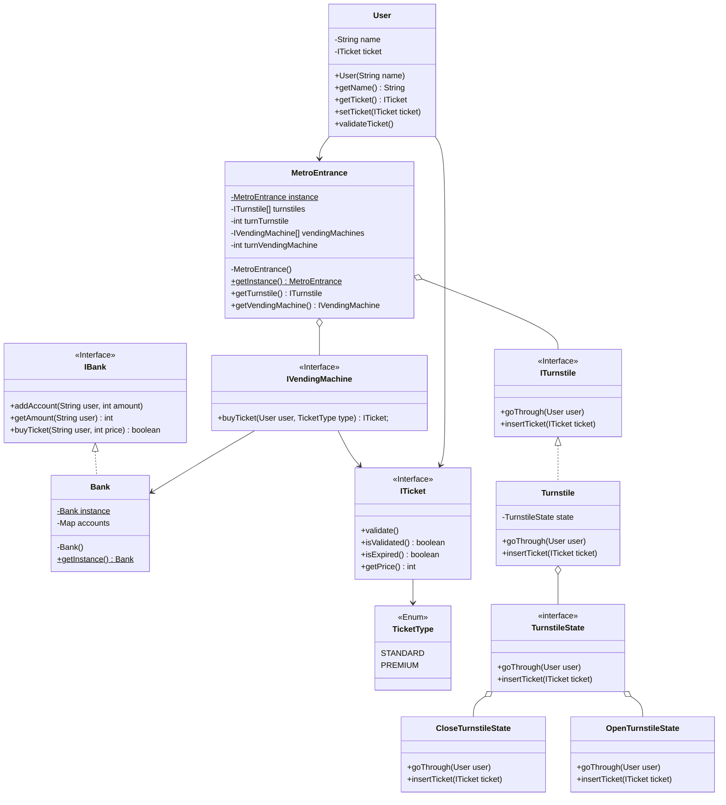

```mermaid
classDiagram

class IBank {
    <<Interface>>
    +addAccount(String user, int amount)
    +getAmount(String user) int
    +buyTicket(String user, int price) boolean
}

class Bank {
    -Bank instance$
    -Map<String, Integer> accounts
    -Bank()
    +getInstance()$ Bank
}

class IVendingMachine {
    <<Interface>>
    +buyTicket(User user, TicketType type) ITicket;
}

class ITicket {
    <<Interface>>
    +validate()
    +isValidated() boolean
    +isExpired() boolean
    +getPrice() int
}

class ITurnstile {
    <<Interface>>
    +goThrough(User user)
    +insertTicket(ITicket ticket)
}

class User {
    -String name
    -ITicket ticket
    +User(String name)
    +getName() String
    +getTicket() ITicket
    +setTicket(ITicket ticket)
    +validateTicket()
}

class TicketType {
    <<Enum>>
    STANDARD
    PREMIUM
}

class MetroEntrance {
    -MetroEntrance instance$
    -ITurnstile[] turnstiles
    -int turnTurnstile
    -IVendingMachine[] vendingMachines
    -int turnVendingMachine
    -MetroEntrance()
    +getInstance()$ MetroEntrance
    +getTurnstile() ITurnstile
    +getVendingMachine() IVendingMachine
}

IBank <|.. Bank
MetroEntrance o-- ITurnstile
MetroEntrance o-- IVendingMachine
IVendingMachine --> ITicket
IVendingMachine --> Bank
ITicket --> TicketType
User --> ITicket
User --> MetroEntrance


ITurnstile <|.. Turnstile
Turnstile o-- TurnstileState
TurnstileState o-- CloseTurnstileState
TurnstileState o-- OpenTurnstileState

class Turnstile {
    -TurnstileState state
    +goThrough(User user)
    +insertTicket(ITicket ticket)
}
class TurnstileState {
    <<interface>>
    +goThrough(User user)
    +insertTicket(ITicket ticket)
}
class CloseTurnstileState {
    +goThrough(User user)
    +insertTicket(ITicket ticket)
}
class OpenTurnstileState {
    +goThrough(User user)
    +insertTicket(ITicket ticket)
}

```