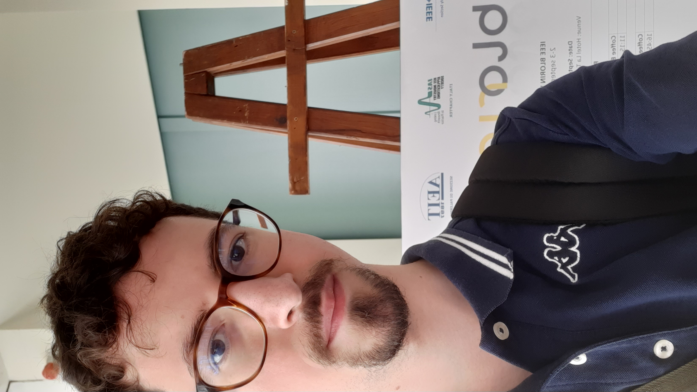

# Introduzione

Tutorato del corso di [Ingegneria del Software](https://web.dmi.unict.it/corsi/l-31/insegnamenti?seuid=609219B7-63E2-417A-BDFD-A86B9856BAF1) 2022/2023.

<!-- New section -->

## Chi sono

- Ernesto Casablanca
- TendTo
- Studente di informatica
- Secondo anno di magistrale

<!-- New subsection -->

### Contatti

- [Email](mailto:casablancaernesto@gmail.com)
- [Telegram](https://t.me/TendTo)
- [Github](https://github.com/TendTo)

<!-- New section -->

## Materiale

Tutto il materiale, lezione per lezione, sarà disponibile su [Github](https://github.com/TendTo/Tutorato-Ingegneria-del-Software).

Le slide, in particolare, saranno consultabili [online](https://tendto.github.io/Tutorato-Ingegneria-del-Software), sotto forma di slideshow.

<!-- .element: class="fragment" data-fragment-index="1" -->

Se avete suggerimenti o correzioni da fare, aprite una [issue](https://github.com/TendTo/Tutorato-Ingegneria-del-Software/issues).

<!-- .element: class="fragment" data-fragment-index="2" -->

<!-- New section -->

## Organizzazione del corso

Sarà data priorità alle vostre richieste.

Ci si concentrerà particolarmente sulla parte di laboratorio.

<!-- .element: class="fragment" data-fragment-index="1" -->

<!-- New subsection -->

### Argomenti trattati

