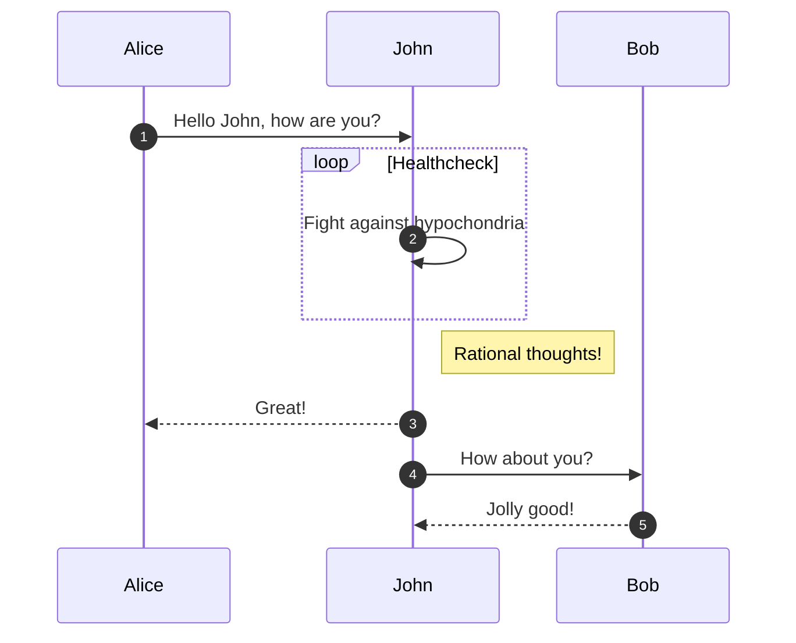

# Title

A paragraph with some text and a [link](http://hakim.se).

<!-- New section -->

## Subsection

<!-- New subsection -->

### Sub section

Sub section

<!-- New subsection -->

### Sub sub section

Sub sub section

<!-- New section -->

## Lists

- Item 1
- Item 2
- Item 3
- Item 4

And another one

1. Item 1
1. Item 2
1. Item 3
1. Item 4

<!-- New section -->

## Tables

| Tables        |      Are      |  Cool |
| ------------- | :-----------: | ----: |
| col 3 is      | right-aligned | $1600 |
| col 2 is      |   centered    |   $12 |
| zebra stripes |   are neat    |    $1 |

<!-- New section -->

## Math

Testo con math $1 + 1 = 2 \quad \forall x \in \mathbb{R}$

$$
\begin{align}
    \text{A lot of math} \\
    1 + 2 = \sum_{i = 1}^2 i \\
    1 + 3 = 4
\end{align}
$$

<!-- New section -->

## Code

```c [1|3|6,7]
#include <stdio.h>

void main(int argc, char *argv[]) {
    printf("Hello world!");

    // Open a socket
    int sock = socket(AF_INET, SOCK_STREAM, 0);
}
```

<!-- New section -->

## Columns

<div class=cols>

- ELement 1
- element 2
- element 3




</div>
