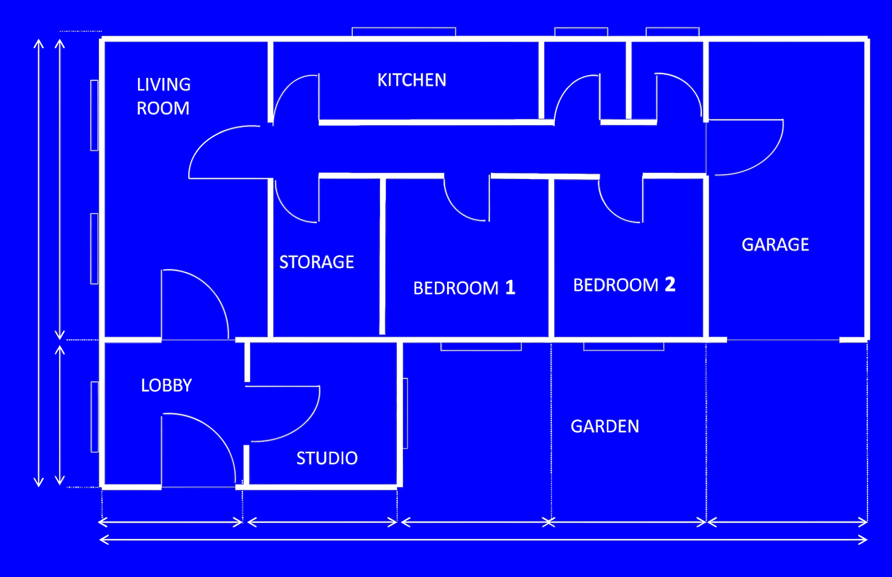

# Java

Installazione e primi passi in Java.

<!-- New section -->

## Obiettivi

- Installare Java
- Configurare l'ambiente di sviluppo (VsCode)
- Concetti base e keyword
- Il primo hello world
- Parametri da linea di comando
- Input utente
- Leggere e scrivere su file

<!-- New section -->

## Java

Java è un linguaggio di programmazione sviluppato da Sun Microsystems nel 1995.  
Si tratta un linguaggio ad alto livello orientato agli oggetti e fortemente tipizzato.

Dopo averlo compilato i programmi in bytecode, questo viene eseguito su una macchina virtuale (JVM), disponibile per tutti i sistemi operativi.  
Il codice scritto in Java può essere eseguito su qualsiasi sistema, al costo di una penalità di prestazioni.

<!-- .element: class="fragment" -->

<!-- New section -->

## Installazione

<!-- New subsection -->

### Windows

- Scaricare l'installer (msi) da [qui](https://learn.microsoft.com/en-us/java/openjdk/download#openjdk-17)
- Lanciare l'installer

<!-- New subsection -->

### MAC

#### Homebrew

- Assicurarsi di avere installato [Homebrew](https://brew.sh/)
- Lanciare il comando `brew install openjdk@17`
- [Ulteriori dettagli](https://formulae.brew.sh/formula/openjdk)

<!-- New subsection -->

#### Manualmente

- Scaricare l'installer (tar.gz) per la versione 17.0.2 da [qui](https://jdk.java.net/archive/)
- Decomprimere il file ` tar -xf <nome_fiel>.tar.gz -C <destinazione>`
- Esportate le variabili d'ambiente `export JAVA_HOME=<destinazione>/jdk-17.0.2.jdk/Contents/Home` e `export PATH=\$JAVA_HOME/bin:\$PATH`

<!-- New subsection -->

### Linux

Utilizzate il gestore dei pacchetti del vostro sistema operativo.

#### Ubuntu

```shell
sudo apt install openjdk-17-jdk
```

#### Arch

```shell
sudo pacman -S jdk17-openjdk
```

#### Fedora

```shell
sudo dnf install java-17-openjdk
```

<!-- New section -->

### Cambiare versione di Java

Se si hanno installate più versioni di Java, è possibile cambiare la versione predefinita.

<!-- New subsection -->

#### Windows

Modificare la variabile d'ambiente `JAVA_HOME` con il percorso della nuova versione di Java.

`System Properties > Environment Variables > System variables > JAVA_HOME`

[Ulteriori dettagli](https://www.happycoders.eu/java/how-to-switch-multiple-java-versions-windows/)

<!-- New subsection -->

#### MAC

Bisogna modificare la variabile d'ambiente `JAVA_HOME` con il percorso della nuova versione di Java.

```shell
/usr/libexec/java_home -V # mostra le versioni di Java installate
export JAVA_HOME=`/usr/libexec/java_home -v <versione>` # cambia la versione di Java a quella indicata
```

<!-- New subsection -->

Per cambiare la versione di Java in maniera permanente, bisogna aggiungere una riga simile al file `~/.bash_profile`, `~/.bashrc` o `~/.zshrc`.

```shell
# ~/.bash_profile
export JAVA_HOME=`/usr/libexec/java_home -v 17`

# ~/.bashrc
export JAVA_HOME=`/usr/libexec/java_home -v 17`

# ~/.zshrc
export JAVA_HOME=$(/usr/libexec/java_home -v 17)

# ~/.fishrc
set -x JAVA_HOME (/usr/libexec/java_home -d64 -v 17)
```

[Ulteriori dettagli](https://stackoverflow.com/a/24657630/15153171)

<!-- New subsection -->

#### Linux

Vale la stessa logica di MAC per l'update della variabile d'ambiente `JAVA_HOME`.

#### Ubuntu

```shell
sudo update-alternatives --config java # mostra le versioni di Java installate e permette di sceglierne una
sudo update-alternatives --config javac # mostra le versioni di javac installate e permette di sceglierne una
```

#### Arch

```shell
sudo archlinux-java status # mostra le versioni di Java installate
sudo archlinux-java set java-17-openjdk # cambia la versione di Java a quella indicata
```

<!-- New section -->

## Comandi utili per Java

- `java -version`
  - mostra la versione di Java installata
- `java -jar <nome_file>.jar`
  - esegue un file jar
- `javac <nome_file>.java`
  - compila un file java in bytecode (_.class_)
- `java <nome_file>`
  - esegue un file java

<!-- New subsection -->

- `javap <nome_file>.class`
  - decompila un file file bytecode restituendo il codice sorgente, se possibile
- `jar cf <nome_output_file>.jar <files>.class`
  - crea un file jar archivio contenente i file _class_
- `jar cfe <nome_output_file>.jar <main_class> <files>.class`
  - crea un file jar eseguibile contenente i file _class_

<!-- New section -->

## Editor

<!-- New subsection -->

### Intellij

- Scaricare l'[installer](https://www.jetbrains.com/idea/download/)
- In qualità di studenti, è possibile riscattare una [licenza gratuita](https://www.jetbrains.com/student/)

<!-- New subsection -->

### Eclipse

- Scaricare l'[installer](https://www.eclipse.org/downloads/)

<!-- New subsection -->

### VsCode

- Installare [VsCode](https://code.visualstudio.com/)
- Installare l'estensione [Java Extension Pack](https://marketplace.visualstudio.com/items?itemName=vscjava.vscode-java-pack)

<!-- New section -->

## Concetti base

Alcuni concetti fondamentali di Java e della programmazione orientata agli oggetti.

<!-- New subsection -->

### Linguaggio orientato agli oggetti

Java è un linguaggio **fortemente** orientato agli oggetti.

Ogni programma può essere visto come una collezione di oggetti che interagiscono tra loro.

<!-- .element: class="fragment" -->

I design pattern ci aiutano a strutturare il codice al fine di renderlo più mantenibile e leggibile anche per progetti particolarmente complessi.

<!-- .element: class="fragment" -->

L'esecuzione di un programma Java parte da un metodo `main` con una firma ben precisa che si trova nella classe indicata.

<!-- .element: class="fragment" -->

<!-- New subsection -->

### Classe vs Oggetto

Una classe è un modello che descrive un oggetto. Un oggetto è una istanza di una classe.

#### Piantina vs Casa

<div class="cols">

</img>

</img>

</div>

<!-- New subsection -->

### Keyword

Le parole chiave riservate a Java.

<!-- New subsection -->

#### Static

```java
class StaticClass {
    private static String staticVar = "I'm static";
    public static void staticMethod() {
        System.out.println("Static variable value: " + staticVar);
    }
}
```

Indica metodi o variabili appartenenti alla classe e non all'oggetto.

Possono essere chiamati senza aver creato un oggetto.

<!-- .element: class="fragment" -->

Hanno accesso solo ad altri metodi o variabili statici.

<!-- .element: class="fragment" -->

<!-- New subsection -->

#### Final

```java
final class FinalClass {
    private final String FINAL_VAR = "I'm final";
    public final void finalMethod() {
        // FINAL_VAR = "I'm not final anymore"; // Error
        System.out.println("Final variable value: " + FINAL_VAR);
    }
}
```

Si tratta di variabili, metodi o classi che non possono essere modificati.

**Variabili**: Non possono essere riassegnate.

<!-- .element: class="fragment" -->

**Metodi**: Non possono essere sovrascritti da classi derivate.

<!-- .element: class="fragment" -->

**Classi**: Non possono essere estese da altre classi.

<!-- .element: class="fragment" -->

<!-- New subsection -->

#### Interface

```java
interface Interface {
    public void interfaceMethod();
}
```

Si tratta di un insieme di metodi astratti.

Non possono contenere variabili.

<!-- .element: class="fragment" -->

<!-- New subsection -->

#### Abstract

```java
abstract class AbstractClass {
    public abstract void abstractMethod();
    public void definedMethod() {
        System.out.println("I'm defined");
    }
}
```

Si tratta di classi che non possono essere istanziate.

Possono contenere metodi astratti: senza un corpo, ma con una firma.

<!-- .element: class="fragment" -->

<!-- New subsection -->

#### Access modifiers

```java
class MyClass {
    private int privateVar;
    protected int protectedVar;
    int defaultVar;
    public int publicVar;
}
```

Servono ad indicare il livello di visibilità di una variabile, metodo o classe.

**private**: Accessibile solo all'interno della classe.

<!-- .element: class="fragment" -->

**protected**: Accessibile all'interno della classe e delle classi derivate.

<!-- .element: class="fragment" -->

**default**: Accessibile da tutte le classi dello stesso package.

<!-- .element: class="fragment" -->

**public**: Accessibile ovunque.

<!-- .element: class="fragment" -->

<!-- New subsection -->

#### Override

```java
class BaseClass {
    public void method() {
        System.out.println("BaseClass method");
    }
}

class DerivedClass extends BaseClass {
    @Override
    public void method() {
        System.out.println("DerivedClass method");
    }
}
```

Metodo sovrascritto da una classe derivata.

Il metodo deve avere la stessa firma del metodo sovrascritto.

<!-- .element: class="fragment" -->

È possibile richiamare il metodo sovrascritto con la parola chiave `super.<metodo>(args)`.

<!-- .element: class="fragment" -->

<!-- New subsection -->

#### Overload

```java
class OverloadClass {
    public void method() {
        System.out.println("No parameters");
    }
    public void method(int a) {
        System.out.println("One parameter");
    }
    public void method(int a, int b) {
        System.out.println("Two parameters");
    }
}
```

Indica che un metodo è stato definito più volte con lo stesso nome ma con parametri diversi.

<!-- New section -->

## Hello World

Il primo programma di ogni buon informatico.

<!-- New subsection -->

### Codice

```java[|1|3,7|4-6|4|5|]
// HelloWorld.java

class HelloWorld {
    public static void main(String[] args) {
        System.out.println("Hello World!");
    }
}
```

<!-- New subsection -->

### Compilazione ed esecuzione

```shell
javac HelloWorld.java
java HelloWorld
```

<!-- New section -->

## Parametri da linea di comando

Quando si lancia un programma da linea di comando, è possibile passare dei parametri che saranno poi accessibili al programma stesso sotto forma di un array di stringhe.

```java
public static void main(String[] args)
```

<!-- New subsection -->

### Codice

```java[|1|21|22-26|28,29|30|4|5-18|32|]
// Calculator.java

class Calculator {
    private static int calculateResult(int a, int b, String op) {
        switch (op) {
            case "+":
                return a + b;
            case "-":
                return a - b;
            case "x":
                return a * b;
            case "/":
                return a / b;
            default:
                System.err.println("Unknown operator");
                System.exit(1);
                return 0;
        }
    }

    public static void main(String[] args) {
        if (args.length != 3) {
            System.err.println("Usage: java Calculator <a> <op> <b>");
            System.err.println("<op> can be +, -, x, /");
            System.exit(1);
        }

        int a = Integer.parseInt(args[0]);
        int b = Integer.parseInt(args[2]);
        int result = calculateResult(a, b, args[1]);

        System.out.println(result);
    }
}
```

<!-- New subsection -->

### Compilazione ed esecuzione

```shell
javac Calculator.java
java Calculator 2 + 3
```

<!-- New section -->

## Input utente

Il programma può interagire con l'utente stampando e leggendo i caratteri sul terminale.  
Vi sono diversi modi per farlo.
In questo caso utilizzeremo la classe `Scanner`.

<!-- New subsection -->

### Codice

```java[|4|1,2|48|49,50|52|7-23|53|25-38|57|58|40-45|60-64|]
import java.util.Random;
import java.util.Scanner;

// InverseCalculator.java

public class InverseCalculator {
    private static char getRandomOp() {
        Random random = new Random();
        int op = random.nextInt(4);

        switch (op) {
            case 0:
                return '+';
            case 1:
                return '-';
            case 2:
                return 'x';
            case 3:
                return '/';
            default:
                return 'e';
        }
    }

    private static int calculateResult(int a, int b, char op) {
        switch (op) {
            case '+':
                return a + b;
            case '-':
                return a - b;
            case 'x':
                return a * b;
            case '/':
                return a / b;
            default:
                return 0;
        }
    }

    private static int readAnswer() {
        Scanner scanner = new Scanner(System.in);
        int answer = scanner.nextInt();
        scanner.close();
        return answer;
    }

    public static void main(String[] args) {
        Random random = new Random();
        int a = random.nextInt(20);
        int b = random.nextInt(10);

        char op = getRandomOp();
        int result = calculateResult(a, b, op);

        System.out.print("What is " + a + " " + op + " " + b + "? ");

        // int answer = Integer.parseInt(System.console().readLine());
        int answer = readAnswer();

        if (answer == result) {
            System.out.println("Correct!");
        } else {
            System.out.println("Wrong!");
        }
    }
}
```

<!-- New subsection -->

### Compilazione ed esecuzione

```shell
javac InverseCalculator.java
java InverseCalculator
```

<!-- New section -->

## Leggere e scrivere su file

Leggere e scrivere su file è un'altra operazione estremamente frequente in un programma.

Per leggere e scrivere su file si utilizzerà la classe `FileReader` e `FileWriter`.

<!-- .element: class="fragment" -->

<!-- New subsection -->

### Codice

```java[|8|1-6|42-45|49|11-27|50|29-39|]
import java.io.BufferedReader;
import java.io.BufferedWriter;
import java.io.FileReader;
import java.io.FileWriter;
import java.io.IOException;
import java.io.PrintWriter;

// WordCounter.java

public class WordCounter {
    private static int readWords(String file) {
        try (FileReader fileReader = new FileReader(file)) {
            BufferedReader bufferedReader = new BufferedReader(fileReader);
            String line;
            int wordCount = 0;
            while ((line = bufferedReader.readLine()) != null) {
                String[] words = line.split(" ");
                wordCount += words.length;
            }
            bufferedReader.close();
            return wordCount;
        } catch (IOException e) {
            e.printStackTrace();
            System.exit(1);
        }
        return 0;
    }

    public static void writeCount(String file, int count) {
        try (FileWriter fileWriter = new FileWriter(file)) {
            BufferedWriter bufferedWriter = new BufferedWriter(fileWriter);
            PrintWriter printWriter = new PrintWriter(bufferedWriter);
            printWriter.println(count);
            printWriter.close();
        } catch (IOException e) {
            e.printStackTrace();
            System.exit(1);
        }
    }

    public static void main(String[] args) {
        if (args.length != 2) {
            System.err.println("Usage: java WordCounter <input_file> <output_file>");
            System.exit(1);
        }

        String inputFile = args[0];
        String outputFile = args[1];
        int wordCount = readWords(inputFile);
        writeCount(outputFile, wordCount);
    }
}
```

<!-- New subsection -->

### Compilazione ed esecuzione

```shell
javac WordCount.java
java WordCount.java input.txt output.txt
```

<!-- New section -->

## Challenge

- Scrivere un Hello World in maniera più creativa
- Scrivere un programma che calcoli l'area di un cerchio
- Individuare il bug che affligge il programma di calcolo inverso
- Rendere più interattivo il programma di calcolo inverso, chiedendo all'utente di rispondere più volte e parametrizzandolo da riga di comando
- Scrivere un programma che conti il numero di occorrenze di una specifica parola in un numero arbitrario di file di testo
