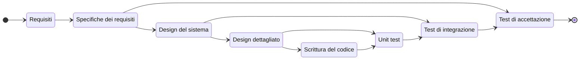
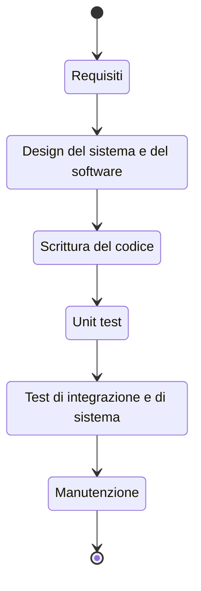
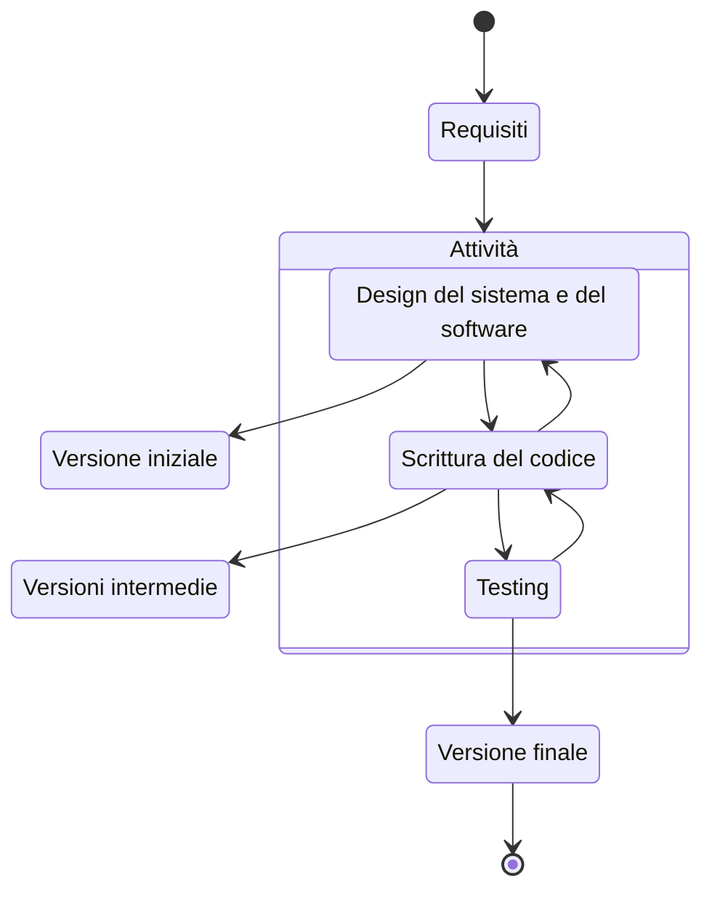

# Processi di sviluppo software

Tutti i passi necessari a creare un software in maniera professionale

<!-- New section -->

## Fasi dello sviluppo

Lo sviluppo di un software può essere suddiviso in varie fasi comuni e collegate fra loro:

- Analisi dei requisiti
- Progettazione
- Codifica o implementazione
- Convalida o Testing
- Manutenzione

<!-- New subsection -->

### Analisi dei requisiti

È la fase in cui vengono individuate le specifiche, i vincoli e le funzionalità che il software dovrà avere.

Si può differenziare fra:

<!-- .element: class="fragment" data-fragment-index="1" -->

- **Requisito**: caratteristica che il software deve possedere. Tendono ad essere molto granulari
- **Specifica**: descrizione rigorosa delle caratteristiche del software
- **Feature**: un insieme di requisiti correlati fra di loro. Soddisfano un obiettivo

<!-- .element: class="fragment" data-fragment-index="1" -->

<!-- New subsection -->

#### Requisiti

I passi per l'individualizzazione dei requisiti sono:

- Studio della fattibilità
- Analisi dei requisiti
- Specifica dei requisiti
- Convalida dei requisiti

I requisiti si dividono in:

<!-- .element: class="fragment" data-fragment-index="1" -->

- **Funzionali**: cosa il sistema deve fare (funzionalità)
- **Non funzionali**: come il sistema fa qualcosa (affidabilità, efficienza, manutenibilità)

<!-- .element: class="fragment" data-fragment-index="1" -->

<!-- New subsection -->

### Progettazione

Viene stabilita una struttura del progetto in grado di soddisfare i requisiti.

Dopo averli individuati, li si suddivide definendo dei sottosistemi atomici quanto più indipendenti possibili.
Si stabiliscono le interfacce e le interazioni che avverranno fra i sottosistemi.

<!-- .element: class="fragment" -->

<!-- New subsection -->

### Implementazione

Nella fase implementativa i modelli del progetto sono tradotti in un programma.

La scrittura di codice potrebbe introdurre errore implementativi.
Per rimuoverli in maniera sistematica, è necessario localizzare il bug, correggere il codice e verificarne la correttezza.  
Questo processo può essere automatizzato con gli strumenti di testing.

<!-- .element: class="fragment" -->

<!-- New subsection -->

### Convalida e test

Bisogna assicurarsi che il software prodotto è conforme alle specifiche e soddisfi le aspettative del cliente.

Si utilizzano processi di revisione e test.

<!-- .element: class="fragment" data-fragment-index="1" -->

<!-- New subsection -->

#### Tipi di test

I test possono essere:

- **Unitari (unit test)**: le singole componenti sono testate singolarmente. Fa largo uso del mocking
- **Di sistema (integration)**: l'intero sistema è messo alla prova con test più pervasivi che verificano le interazioni fra le componenti
- **Di accettazione (alpha)**: si coinvolge il cliente per assicurarsi che il software soddisfi le sue aspettative
- **Beta test**: test svolti nel momento in cui il prodotto è quasi completo

<!-- New subsection -->

### Schema

<!-- New section -->

## Cascata (Waterfall)

Uno dei primi processi di sviluppo software, anni '70.

Il focus è sull'ottenere un prodotto completo.

<!-- .element: class="fragment" -->

Tutti i passaggi si eseguono in sequenza e in maniera contigua.

<!-- .element: class="fragment" -->

<!-- New subsection -->

### Cascata: pro e contro

- Efficiente se i requisiti non sono soggetti a modifiche e sono ben definiti
- Architetture tendenzialmente monolitiche
- Alta qualità di codice e documentazione, con buona coerenza

 

- Tempi lunghi per ottenere un primo prodotto
- Poca interazione con i clienti
- Grandi difficoltà ad introdurre cambiamenti in corso d'opera

<!-- New subsection -->

### Cascata: schema

<!-- New section -->

## Evolutivo

Al contrario del modello a cascata, il modello evolutivo prevede che il software venga sviluppato in maniera incrementale, con una stretta collaborazione con il cliente.

Vi sono due approcci:

<!-- .element: class="fragment" data-fragment-index="1" -->

- Esplorazione
- Build and fix

<!-- .element: class="fragment" data-fragment-index="1" -->

<!-- New subsection -->

### Evolutivo: esplorazione

Gli sviluppatori lavorano a stretto contatto con il cliente.

Dai requisiti iniziali, comunque chiari, si prosegue aggiungendo la nuove caratteristiche che il cliente definisce man mano.

<!-- .element: class="fragment" -->

<!-- New subsection -->

### Evolutivo: build and fix

Si sviluppa il software in maniera incrementale, senza una progettazione totale.

Si parte da una prima versione e vi si aggiungono features fino a quando il cliente non è soddisfatto.

<!-- .element: class="fragment" -->

<!-- New subsection -->

### Evolutivo: pro e contro

- Efficiente per sistemi di piccole dimensioni
- Può essere funzionale a progetti con requisiti poco chiari

 

- Tempi che possono diventare anche molto lunghi, se sono necessarie molte iterazioni
- Mancanza di visione d'insieme del progetto
- Difficoltà di manutenzione

<!-- New subsection -->

### Evolutivo: schema

<!-- New section -->

## Sviluppo Agile

Nel processo di sviluppo Agile ci si concentra su auto-organizzazione, collaborazione e comunicazione fra i membri del team.

Vengono privilegiati:

<!-- .element: class="fragment" data-fragment-index="1" -->

- **Individui** rispetto a processi e strumenti
- **Software funzionante** rispetto alla documentazione
- **Confronto con il client** rispetto a contratti
- **Rispondere al cambiamento** rispetto a seguire un piano

<!-- .element: class="fragment" data-fragment-index="1" -->

<!-- New subsection -->

### Caratteristiche chiave

Tutti i processi di sviluppo che intendono essere Agile devono:

- Essere in grado di effettuare modifiche anche significative al codice durante qualsiasi fase dello sviluppo
- Fornire delle release di software funzionanti in maniera frequente
- Cercare di coinvolgere il cliente il più possibile
- Creare un gruppo di lavoro motivato e collaborativo
- Attenzionare l'eccellenza tecnica

<!-- New section -->

## Extreme Programming (XP)

L'XP è un processo di sviluppo Agile che si concentra sulla consegna di software con un numero di funzionalità che viene incrementato con ogni iterazione.

- **2 settimane per lo sviluppo degli incrementi**
- **Piccoli gruppi** (2 - 12 persone)
- **Costante miglioramento del codice**
- **Poca documentazione**
- **Comunicazione diretta tra persone**
- **Iterazioni corte**
- **Interazioni fra sviluppatori, clienti e manager**
- **Testabilità dei prodotti e prodotti**

<!-- New subsection -->

### I 12 principi dell'XP (1-2)

1. **Gioco della pianificazione**: gli utenti scrivono le storie (i requisiti). Gli sviluppatori stimano il tempo di sviluppo per ogni storia, suddividendosi i compiti. In base a questo, viene identificata una possibile finestra di lancio per la prossima iterazione del software.
2. **Piccole release**: ogni 2 settimane, dovrebbe esserci una nuova release. In questa maniera gli sviluppatori ottengono un feedback rapido da parte del cliente, nonché la possibilità di correggere gli errori in maniera tempestiva.

<!-- New subsection -->

### I 12 principi dell'XP (3-4)

3. **Metafora**: guidare il progetto con una singola metafora, per assicurarsi che sviluppatori e cliente anno la stessa visione del progetto.
4. **Design semplice**: il software dovrebbe
   - Passare i test
   - Non avere parti duplicate
   - Essere coerente con le intenzioni degli sviluppatori
   - Utilizzare il numero più piccolo possibile di classi e metodi

<!-- New subsection -->

### I 12 principi dell'XP (5-6)

5. **Test**: il codice dovrebbe essere scritto in maniera tale da poter essere testato in maniera automatica, e ripetuto per ogni piccola modifica della codebase. Ci devono essere sia test funzionali, per assicurarsi che i requisiti dell'utente siano soddisfatti, che unit test, per assicurarsi che il codice continui a funzionare correttamente.
6. **Refactoring**: il codice dovrebbe essere refattorizzato in maniera costante, per assicurarsi che sia sempre semplice e pulito. Questo permette di ridurre la complessità del codice, e di renderlo più facile da mantenere.

<!-- New subsection -->

### I 12 principi dell'XP (7-8-9)

7. **Pair programming**: due sviluppatori lavorano insieme su un singolo computer. Uno scrive il codice, l'altro controlla che sia corretto, alternandosi. Questo permette di ridurre gli errori e di condividere le conoscenze.
8. **Cliente in sede**: un interazione tempestiva con il client, coinvolto nel processo di sviluppo, permette di assicurarsi che la direzione che il software sta prendendo continui ad essere allineate con le necessità di chi l'ha commissionato.
9. **Possesso del codice collettivo**: chiunque può effettuare una modifica alla codebase, anche se non è l'autore originale. Il risultato è quello di distribuire le conoscenze sul funzionamento del sistema.

<!-- New subsection -->

### I 12 principi dell'XP (10-11-12)

10. **Integrazione continua**: il codice prodotto viene introdotto immediatamente nel software, a patto che passi i test. In caso contrario, la coppia che l'ha prodotto deve occuparsi di aggiustarlo, anche ricreando il codice da zero, se necessario.
11. **Settimana di 40 ore**: tutti i task dovrebbero essere suddivisi in modo da poter essere svolti in settimane di 40 ore, al fine di non sforzare gli sviluppatori.
12. **Usare gli standard per il codice**: seguire gli standard permette a chiunque di avere un'idea chiara del funzionamento del codice e favorisce la collaborazione.

<!-- New subsection -->

### XP: in breve

- Ci si focalizza sul codice e sulle persone
- Codifica e test sono complementari
- La conoscenza del sistema è trasferita attraverso la comunicazione tra la gente
- Creare prodotti di qualità tramite test rigorosi
- Creare fiducia reciproca tra sviluppatori e clienti tramite comunicazione continua

<!-- New section -->

## Scrum

La metodologia Scrum è un framework Agile per lo sviluppo di prodotti complessi.

Nella metodologia Scrum, c'è un **Product owner** che elenca il lavoro da svolgere tramite un **Product backlog**.
Lo **Scrum team** effettua una parte del lavoro, incrementando le funzionalità del prodotto, in uno **sprint**.
Ci si confronta quanto più spesso possibile per valutare i progressi e aggiornare il backlog, stabilendo i prossimi sprint.

<!-- New subsection -->

### I pilastri dello Scrum: Trasparenza

Tutti i membri del team devono avere una visione chiara del prodotto e del lavoro da svolgere. Le decisioni importanti sono prese sulla base di tre artefatti: **Product backlog**, **Sprint backlog** e **Incremento**.

- **Product backlog**: elenco di tutto il lavoro ancora da svolgere sul prodotto
- **Sprint backlog**: elenco di tutto il lavoro ancora da svolgere durante lo sprint
- **Incremento**: insieme di tutte le funzionalità aggiunte durante lo sprint

<!-- New subsection -->

### I pilastri dello Scrum: Ispezione

I progressi vengono valutati in maniera costante durante il corrispettivo evento, per assicurarsi che il prodotto stia procedendo nella direzione giusta.

- **Sprint**: lunghezza fissata, tipicamente un mese
- **Sprint planning**: pianificazione dello sprint
- **Daily scrum**: evento giornaliero in cui si valuta e aggiorna lo sprint backlog
- **Sprint review**: vengono verificati i risultato dello sprint
- **Sprint retrospective**: vengono valutati i risultati dello sprint, successi e criticità

<!-- New subsection -->

### I pilastri dello Scrum: Adattamento

Se si incontra una criticità nello sviluppo, il processo o ciò che è prodotto deve essere aggiustato.
L’aggiustamento si attua subito per evitare ulteriori divergenze

