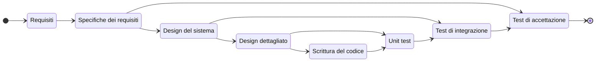
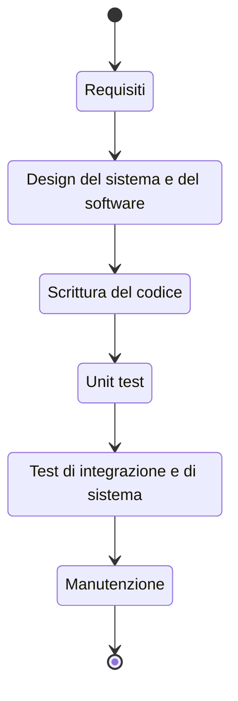
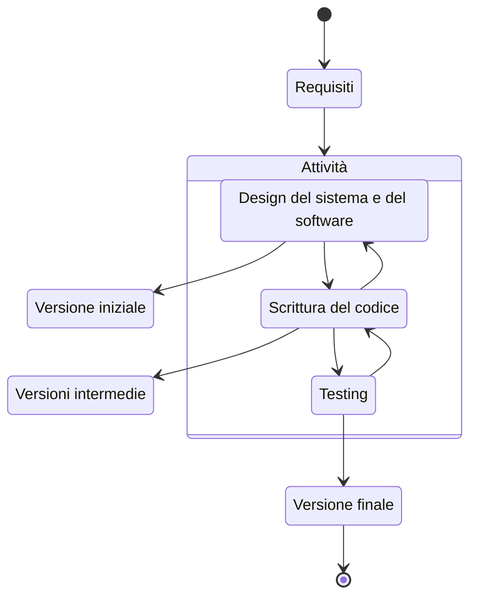

# Processi di sviluppo software

Tutti i passi necessari a creare un software in maniera professionale

<!-- New section -->

## Fasi dello sviluppo

Lo sviluppo di un software può essere suddiviso in varie fasi comuni e collegate fra loro:

- Analisi dei requisiti
- Progettazione
- Codifica o implementazione
- Convalida o Testing
- Manutenzione

<!-- New subsection -->

### Analisi dei requisiti

È la fase in cui vengono individuate le specifiche, i vincoli e le funzionalità che il software dovrà avere.

Si può differenziare fra:

<!-- .element: class="fragment" data-fragment-index="1" -->

- **Requisito**: caratteristica che il software deve possedere. Tendono ad essere molto granulari
- **Specifica**: descrizione rigorosa delle caratteristiche del software
- **Feature**: un insieme di requisiti correlati fra di loro. Soddisfano un obiettivo

<!-- .element: class="fragment" data-fragment-index="1" -->

<!-- New subsection -->

#### Requisiti

I passi per l'individualizzazione dei requisiti sono:

- Studio della fattibilità
- Analisi dei requisiti
- Specifica dei requisiti
- Convalida dei requisiti

I requisiti si dividono in:

<!-- .element: class="fragment" data-fragment-index="1" -->

- **Funzionali**: cosa il sistema deve fare (funzionalità)
- **Non funzionali**: come il sistema fa qualcosa (affidabilità, efficienza, manutenibilità)

<!-- .element: class="fragment" data-fragment-index="1" -->

<!-- New subsection -->

### Progettazione

Viene stabilita una struttura del progetto in grado di soddisfare i requisiti.

Dopo averli individuati, li si suddivide definendo dei sottosistemi atomici quanto più indipendenti possibili.
Si stabiliscono le interfacce e le interazioni che avverranno fra i sottosistemi.

<!-- .element: class="fragment" -->

<!-- New subsection -->

### Implementazione

Nella fase implementativa i modelli del progetto sono tradotti in un programma.

La scrittura di codice potrebbe introdurre errore implementativi.
Per rimuoverli in maniera sistematica, è necessario localizzare il bug, correggere il codice e verificarne la correttezza.  
Questo processo può essere automatizzato con gli strumenti di testing.

<!-- .element: class="fragment" -->

<!-- New subsection -->

### Convalida e test

Bisogna assicurarsi che il software prodotto è conforme alle specifiche e soddisfi le aspettative del cliente.

Si utilizzano processi di revisione e test.

<!-- .element: class="fragment" data-fragment-index="1" -->

<!-- New subsection -->

#### Tipi di test

I test possono essere:

- **Unitari (unit test)**: le singole componenti sono testate singolarmente. Fa largo uso del mocking
- **Di sistema (integration)**: l'intero sistema è messo alla prova con test più pervasivi che verificano le interazioni fra le componenti
- **Di accettazione (alpha)**: si coinvolge il cliente per assicurarsi che il software soddisfi le sue aspettative
- **Beta test**: test svolti nel momento in cui il prodotto è quasi completo

<!-- New subsection -->

### Schema

<!-- New section -->

## Cascata (Waterfall)

Uno dei primi processi di sviluppo software, anni '70.

Il focus è sull'ottenere un prodotto completo.

<!-- .element: class="fragment" -->

Tutti i passaggi si eseguono in sequenza e in maniera contigua.

<!-- .element: class="fragment" -->

<!-- New subsection -->

### Cascata: pro e contro

- Efficiente se i requisiti non sono soggetti a modifiche e sono ben definiti
- Architetture tendenzialmente monolitiche
- Alta qualità di codice e documentazione, con buona coerenza

 

- Tempi lunghi per ottenere un primo prodotto
- Poca interazione con i clienti
- Grandi difficoltà ad introdurre cambiamenti in corso d'opera

<!-- New subsection -->

### Cascata: schema

<!-- New section -->

## Evolutivo

Al contrario del modello a cascata, il modello evolutivo prevede che il software venga sviluppato in maniera incrementale, con una stretta collaborazione con il cliente.

Vi sono due approcci:

<!-- .element: class="fragment" data-fragment-index="1" -->

- Esplorazione
- Build and fix

<!-- .element: class="fragment" data-fragment-index="1" -->

<!-- New subsection -->

### Evolutivo: esplorazione

Gli sviluppatori lavorano a stretto contatto con il cliente.

Dai requisiti iniziali, comunque chiari, si prosegue aggiungendo la nuove caratteristiche che il cliente definisce man mano.

<!-- .element: class="fragment" -->

<!-- New subsection -->

### Evolutivo: build and fix

Si sviluppa il software in maniera incrementale, senza una progettazione totale.

Si parte da una prima versione e vi si aggiungono features fino a quando il cliente non è soddisfatto.

<!-- .element: class="fragment" -->

<!-- New subsection -->

### Evolutivo: pro e contro

- Efficiente per sistemi di piccole dimensioni
- Può essere funzionale a progetti con requisiti poco chiari

 

- Tempi che possono diventare anche molto lunghi, se sono necessarie molte iterazioni
- Mancanza di visione d'insieme del progetto
- Difficoltà di manutenzione

<!-- New subsection -->

### Evolutivo: schema

