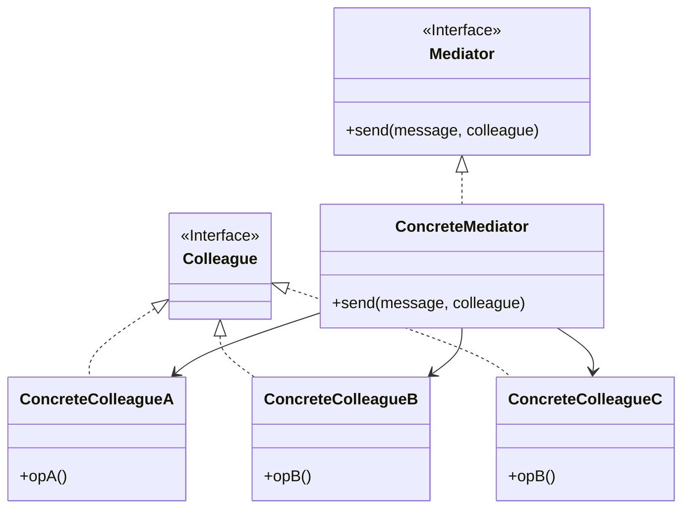
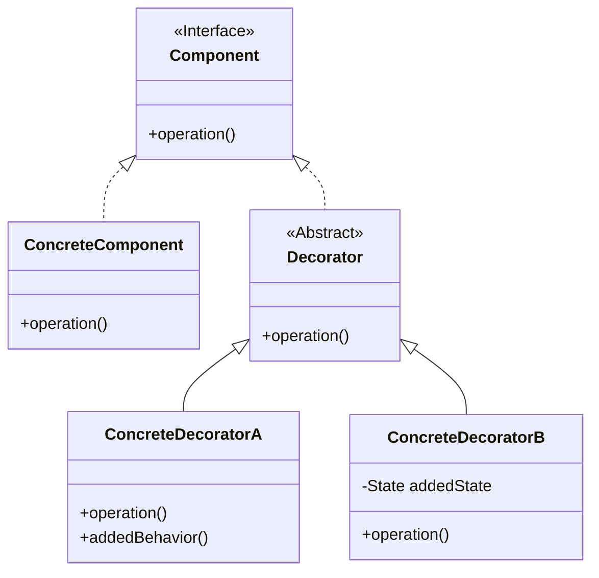
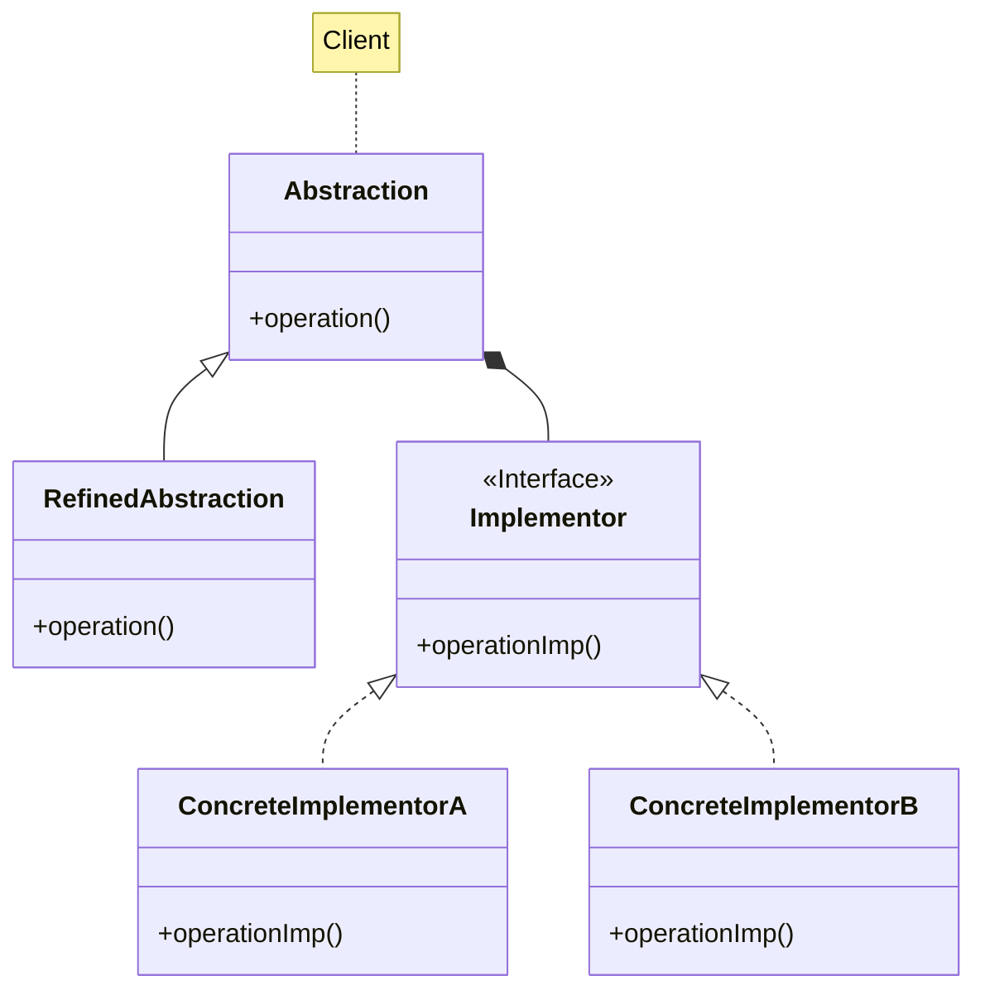
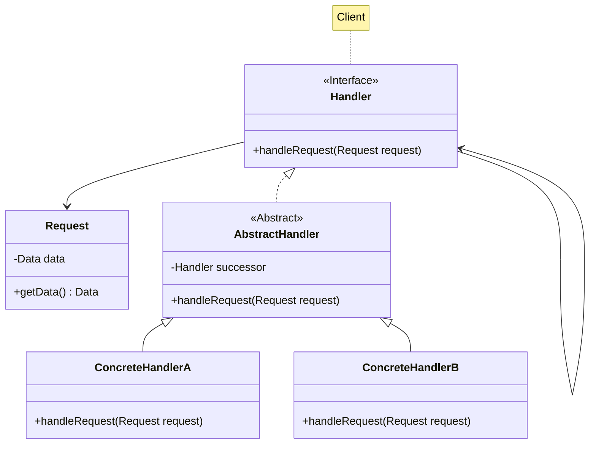

# Mediator, Decorator, Bridge, Chain of Responsibility

Descrizione dei design pattern Mediator, Decorator, Bridge e Chain of Responsibility.

<!-- New section -->

## Mediator

Il Mediator è un design pattern comportamentale.

Definisce un oggetto che incapsula come un insieme di oggetti interagisce.
Invece di rendere strettamente interconnessi tutti gli oggetti del gruppo, si può optare per eleggere un mediatore che si occupi di gestire le interazioni.

<!-- New subsection -->

### Problema e soluzione

<div class="cols">

- Molti oggetti interagiscono con un gran numero di altri oggetti
- Diventa difficile mantenere lasco il coupling fra gli oggetti
- È più complicato nascondere l'utilizzo di certe classi all'esterno

<br/>

- Utilizzo di un oggetto con il compito di mediatore
- Il mediator non avrà altro scopo che raccogliere le chiamate da altri oggetti e redirezionarle al destinatario atteso

</div>

<!-- New subsection -->

### UML



<!-- New subsection -->

### Codice mediator

```java
public class Grid {
    private List<Appliance> appliances = new ArrayList<Appliance>();
    private Meter meter;
    public void setMeter(Meter meter) { this.meter = meter; }
    public void addAppliance(Appliance appliance) { appliances.add(appliance); }
    public void turnOnAll() { appliances.forEach(a -> a.turnOn()); }
    public void turnOffAll() { appliances.forEach(a -> a.turnOff()); }
    public void updateAll() {
        for(Appliance a : appliances) {
            int reading = a.update();
            meter.updateMeter(reading);
        }
    }
    public void turnOn(String appliance) {
        appliances.stream()
            .filter(a -> a.getName().equals(appliance))
            .forEach(a -> a.turnOn());
    }
    public void turnOff(String appliance) {
        appliances.stream()
            .filter(a -> a.getName().equals(appliance))
            .forEach(a -> a.turnOff());
    }
}
```

<!-- New subsection -->

### Codice colleagues: power

```java
public class Meter {
    private Grid grid;
    private int reading = 0;
    Meter(Grid grid) { this.grid = grid; }
    public void turnOn() { grid.turnOnAll(); }
    public void turnOff() { grid.turnOffAll(); }
    public void updateMeter(int reading) {
        this.reading += reading;
    }
}
```

```java
public class Switch {
    private Grid grid;
    Switch(Grid grid) { this.grid = grid; }
    public void turnOn() { grid.turnOn("Light"); }
    public void turnOff() { grid.turnOff("Light"); }
}
```

```java
public class Button {
    private Grid grid;
    Button(Grid grid) { this.grid = grid; }
    public void turnOn() { grid.turnOn("Fan"); }
    public void turnOff() { grid.turnOff("Fan"); }
}
```

<!-- New subsection -->

### Codice colleagues: appliance

```java
public abstract class Appliance {
    protected int consumption;
    protected boolean isOn = false;
    protected Meter meter;
    public void turnOn() { isOn = true; }
    public void turnOff() { isOn = false; }
    public int readConsumption() { return isOn ? consumption : 0; }
}
```

```java
public class Light extends Appliance {
    Light() { this.consumption = 100; }
    public void makeLight() { /* ... */ }
}
```

```java
public class Fridge extends Appliance {
    Fridge() { this.consumption = 200; }
    public void makeCold() { /* ... */ }
}
```

```java
public class Fan extends Appliance {
    Fan() { this.consumption = 50; }
    public void makeAir() { /* ... */ }
}
```

<!-- New subsection -->

### Possibili applicazioni

- Sistema UI con un controllo del flusso complesso
- Accentramento della comunicazione in un sistema distribuito (es. coda di messaggi)
- Gestione di una casa domotica

<!-- New subsection -->

### Pro e contro

<div class="cols">

- Riduzione del coupling fra gli oggetti
- Minore ripetizione di codice
- Semplificazione delle relazioni fra gli oggetti

<br/>

- Rischio di creare un oggetto con troppi compiti
- Il mediator potrebbe diventare un collo di bottiglia
- Introduzione di una classe aggiuntiva potenzialmente superflua

</div>

<!-- New section -->

## Decorator

Il Decorator è un design pattern strutturale.

Permette di aggiungere funzionalità ad un oggetto dinamicamente, senza dover creare una sottoclasse.

<!-- New subsection -->

### Problema e soluzione

<div class="cols">

- Si vogliono aggiungere delle funzionalità ad un oggetto specifico, non all'intera classe
- Le funzionalità potrebbero variare a runtime
- Evitare di dover gestire le ereditarietà multiple

<br/>

- Usare un oggetto che racchiuda quello originale, aggiungendo le funzionalità desiderate
- Più decoratori possono essere aggiunti in cascata, ognuno dando il proprio contributo
- Il decoratore è trasparente al client

</div>

<!-- New subsection -->

### UML



<!-- New subsection -->

### Codice: component

```java
public interface IPizza {
    public void eat();
}
```

```java
public class Pizza implements IPizza {
    @Override
    public void eat() { System.out.println("Una bella pizza"); }
}
```

<!-- New subsection -->

### Codice: decorators

```java
public abstract class PizzaDecorator extends Pizza {
    protected IPizza pizza;
    public PizzaDecorator(IPizza pizza) { this.pizza = pizza; }
    @Override
    public void eat() { pizza.eat(); }
}
```

```java
public class PizzaWithMozzarella extends PizzaDecorator {
    public PizzaWithMozzarella(IPizza pizza) { super(pizza); }
    @Override
    public void eat() {
        super.eat();
        System.out.println("con mozzarella");
    }
}
```

```java
public class PizzaWithTomato extends PizzaDecorator {
    public PizzaWithTomato(IPizza pizza) { super(pizza); }
    @Override
    public void eat() {
        super.eat();
        System.out.println("con pomodoro");
    }
}
```

<!-- New subsection -->

### Possibili applicazioni

- Estendere il codice di una libreria esterna
- Creare un oggetto che vuole aggregare a piacimento caratteristiche diverse
- Creare dei bot che si collegano al server in maniera diversa (es. polling, webhook)

<!-- New subsection -->

### Pro e contro

<div class="cols">

- Aggiungere funzionalità a classi esistenti
- Prendere caratteristiche da più classi senza utilizzare l'ereditarietà multipla
- Creare delle feature riutilizzabili da più classi
- Modificare le feature di un oggetto a runtime

<br/>

- Può diventare difficile rimuovere un singolo decorator una volta che si viene a formare una catena
- Si potrebbero creare dipendenze impreviste legate all'ordine di inizializzazione dei decorator

</div>

<!-- New section -->

## Bridge

Il Bridge è un design pattern strutturale.

Permette di separare l'astrazione dall'implementazione, in modo che entrambe possano variare indipendentemente.

<!-- New subsection -->

### Problema e soluzione

<div class="cols">

- Se un'astrazione può avere più implementazioni, il numero di classi da creare cresce esponenzialmente
- Eventuali modifiche ad una classe andrebbero ripetute in tutte le altre
- Si vuole poter espandere la classe in maniera ortogonale, con diverse combinazioni note di features

<br/>

- Separare astrazione e implementazione
- Utilizzare la relazione di composizione invece che l'ereditarietà

</div>

<!-- New subsection -->

### UML



<!-- New subsection -->

### Codice: abstraction

```java
public abstract class Shape {
    protected Drawing impl;
    public void setImplementor(Drawing imp) { this.impl = imp; }
    public void drawLine(int x, int y, int z, int t){ impl.drawLine(x, y, z, t);}
    public abstract void draw();
```

```java
public class Rectangle extends Shape {
    int x1, y1, x2, y2;
    public Rectangle(int x1, int y1, int x2, int y2) {
        this.x1 = x1;
        this.y1 = y1;
        this.x2 = x2;
        this.y2 = y2;
    }
    @Override
    public void draw() {
        drawLine(x1, y1, x1, y2); drawLine(x1, y1, x2, y1);
        drawLine(x1, y2, x2, y2); drawLine(x2, y1, x2, y2);
    }
```

<!-- New subsection -->

### Codice: implementor

```java
public interface Drawing {
    public void drawLine(int x1, int y1, int x2, int y2);
}
```

```java
public class RedDrawing implements Drawing {
    @Override
    public void drawLine(int x1, int y1, int x2, int y2) {
        System.out.println("Disegno una linea rossa da (x1, y1) a (x2, y2)");
    }
}
```

```java
public class BlueDrawing implements Drawing {
    @Override
    public void drawLine(int x1, int y1, int x2, int y2) {
        System.out.println("Disegno una linea blu da (x1, y1) a (x2, y2)");
    }
}
```

<!-- New subsection -->

### Possibili applicazioni

- Tipi diversi di astrazioni ed implementazioni di cui bisogna considerare tutte le possibili combinazioni
- Tipi diversi di figure e modi per disegnarle
- Modelli di macchine con tipologie di motori differenti

<!-- New subsection -->

### Pro e contro

<div class="cols">

- Maggiore separazione fra le classi con scopi diversi
- Il client tende a lavorare solo con le astrazioni ad alto livello, ignaro delle implementazioni
- Si tende a seguire il principio della singola responsabilità

<br/>

- Potrebbe essere complicato da applicare a classi estremamente interdipendenti
- Aggiunge un livello di astrazione in più che potrebbe non essere necessario

</div>

<!-- New section -->

## Chain of responsibility

La Chain of Responsibility è un design pattern comportamentale.

Permette di creare una catena di oggetti che si occupano di gestire una richiesta, passandola in avanti se non sono in grado di gestirla.

<!-- New subsection -->

### Problema e soluzione

<div class="cols">

- È necessario applicare una serie di operazioni in sequenza
- L'ordine delle operazioni potrebbe variare a seconda di parametri noti a runtime
- Si vuole evitare di dover verificare una serie di condizioni legate da una relazione di congiunzione

<br/>

- Creare una serie di oggetti, ognuno specializzato in una determinata operazione
- Passare la richiesta da un oggetto al prossimo nella catena
- Se l'operazione non va a buon fine, la richiesta viene passata al prossimo oggetto

</div>

<!-- New subsection -->

### UML



<!-- New subsection -->

### Codice: interfacce e classi astratte

```java
public Interface Validation {
    public void handleRequest(Request request);
}
```

```java
public abstract class EmailValidation implements Validation {
    private EmailValidation successor;
    public void setSuccessor(EmailValidation successor) { 
        this.successor = successor; 
    }
    public void handleRequest(Request request) {
        if (successor)
            successor.handleRequest(request);
        else
            System.out.println("Email validata!");
    }
}
```

<!-- New subsection -->

### Codice: concrete handler

```java
public class EmailValidationAt extends EmailValidation {
    public void handleRequest(Request request) {
        if(request.getData().contains("@")) {
            super.handleRequest(request);
        } else {
            System.out.println("Email non valida");
        }
    }
}
```

```java
public class EmailValidationDomain extends EmailValidation {
    public void handleRequest(Request request) {
        if(request.getData().contains(".")) {
            super.handleRequest(request);
        } else {
            System.out.println("Email non valida");
        }
    }
}
```

<!-- New subsection -->

### Possibili applicazioni

- Sistema di autenticazione
- Gestione della validazione dell'input
- Supporto agli utenti

<!-- New subsection -->

### Pro e contro

<div class="cols">

- Si può controllare la gestione delle richieste secondo uno schema lineare
- Ogni classe si occupa di gestire un caso specifico

<br/>

- Bisogna aggiungere un handler per ogni possibile caso, il che potrebbe portare ad una catena molto lunga
- Non c'è garanzia che la richiesta venga gestita

</div>

<!-- New section -->

## Challenge

- (Mediator) Creare un sistema di gestione di un'abitazione domotica. Il mediator potrebbe essere Alexa o Google Home
- (Decorator) Creare un sistema di negozio che vende biglietti regalo. Questi possono avere un packaging e decorazioni diverse
- (Bridge) Creare un sistema di gestione di un'azienda che produce macchine. Le macchine possono avere motori diversi
- (Chain of responsibility) Creare un sistema di autenticazione
