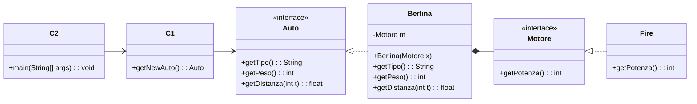
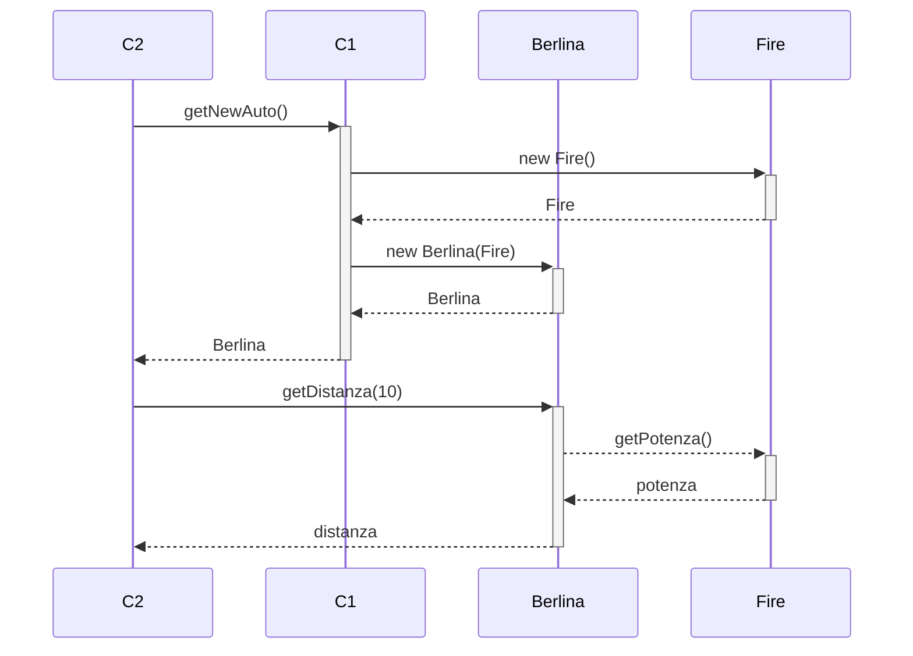

# Esercizi

Esercizi presi dai compiti in classe.

<!-- New subsection -->

## Warning

Questi esercizi sono stati svolti da me e da altri studenti, quindi potrebbero contenere errori.
Se ne trovate, segnalateli.

<!-- New section -->

## Domande a risposta multipla

<!-- New subsection -->

<details>
<summary>
<b>In generale, per convalidare dei requisiti non è possibile</b>
  <ol>
    <li> Eseguirli tramite test
    <li> Servirsi di prototipi
    <li> Usare modelli di analisi di consistenza
    <li> Sviluppare dei test
  </ol>
</summary>
<i>3. Usare modelli di analisi di consistenza</i>
<br/>
Possiamo controllare che il software soddisfi i requisiti tramite test, facendo provare al client i vari prototipi e sviluppando dei test che controllino un determinato requisito.
</details>

<!-- New subsection -->

<details>
<summary>
<b>La frase "Il sistema dovrà fornire prestazioni adeguate" è</b>
  <ol>
    <li> Un requisito molto importante
    <li> Un requisito funzionale
    <li> Un requisito non funzionale
    <li> Un requisito interpretabile in tanti modi
  </ol>
</summary>
<i>3. Un requisito non funzionale</i>
<br/>
I requisiti non funzionali riguardano come il sistema svolge la sua funzione (es. affidabilità, efficienza, prestazioni,
manutenibilità, etc.)
</details>

<!-- New subsection -->

<details>
<summary>
<b>Nell'ingegneria dei requisiti è necessario</b>
  <ol>
    <li> Tutte le risposte
    <li> Risolvere i conflitti fra i requisiti
    <li> Revisionare i requisiti raccolti
    <li> Stabilire le priorità
  </ol>
</summary>
<i>1. Tutte le risposte</i>
<br/>
Tutti i passi elencati vengono applicati nell'ingegneria dei requisiti.
</details>

<!-- New subsection -->

<details>
<summary>
<b>La navigabilità nelle relazioni dei diagrammi UML indica</b>
  <ol>
    <li> Per un oggetto, le istanze di cui invoca i metodi
    <li> Per una classe, quali altre classi conosce/usa
    <li> Per una classe, quali oggetti usa
    <li> Per una classe, le classi di cui è composta
  </ol>
</summary>
<i>2. Per una classe, quali altre classi conosce/usa</i>
<br/>
La freccia singola indica che una classe conosce un'altra classe e la utilizza in una qualche forma.
</details>

<!-- New subsection -->

<details>
<summary>
<b>Le fasi generali del processo RUP sono</b>
  <ol>
    <li> Revisione requisiti, unione e uso componenti, produzione e pianificazione
    <li> Analisi, progettazione, implementazione, test e revisione
    <li> Avvio, elaborazione, costruzione, transizione, produzione
    <li> Revisione, decisione, pianificazione, marketing
  </ol>
</summary>
<i>3. Avvio, elaborazione, costruzione, transizione, produzione</i>
<br/>
<a href="https://it.wikipedia.org/wiki/Rational_Unified_Process">Descrizione del processo RUP.</a>
</details>

<!-- New subsection -->

<details>
<summary>
<b>Il processo a cascata non è adatto a</b>
  <ol>
    <li> Cambiare i requisiti in nessuna delle sue fasi
    <li> Sviluppare sistemi realtime
    <li> Cambiare requisiti durante le fasi della progettazione e codifica
    <li> Produrre prototipi nella prima fase di sviluppo
  </ol>
</summary>
<i>3. Cambiare requisiti durante le fasi della progettazione e codifica</i>
<br/>
Nel processo a cascata, una volta stabiliti i requisiti, questi saranno considerati immutabili ed utilizzati per tutti gli step successivi, che si concludono con il rilascio del prodotto.
</details>

<!-- New subsection -->

<details>
<summary>
<b>Quali delle seguenti attività n on è prevista in nessun processo di sviluppo</b>
  <ol>
    <li> Fornire al cliente gli sviluppatori di software
    <li> Rilasciare al cliente incrementi di software a cadenza regolare
    <li> Permettere al cliente di lavorare nella sede degli sviluppatori
    <li> Valutare se la produzione del software è strategica
  </ol>
</summary>
<i>4. Valutare se la produzione del software è strategica</i>
<br/>
Questa è una valutazione che spetta al cliente, non agli sviluppatori.
</details>

<!-- New subsection -->

<details>
<summary>
<b>Per il design pattern Observer, le sottoclassi di Observer</b>
  <ol>
    <li> Dovrebbero essere al massimo 20
    <li> Dovrebbero avere almeno 2 istanze ciascuna
    <li> Dovrebbero essere almeno 2
    <li> Potrebbero avere una sola istanza ciascuna
  </ol>
</summary>
<i>4. Potrebbero avere una sola istanza ciascuna</i>
<br/>
Il pattern Observer permette ad un numero arbitrario e dinamico di Observer di effettuare un attach al Subject per essere informati di eventuali cambiamenti del suo stato.
</details>

<!-- New subsection -->

<details>
<summary>
<b>Nel design pattern Mediator</b>
  <ol>
    <li> Colleague conosce la sua sottoclasse
    <li> Mediator conosce la sua sottoclasse
    <li> Colleague conosce la sottoclasse di Mediator
    <li> Colleague conosce Mediator
  </ol>
</summary>
<i>4. Colleague conosce Mediator</i>
<br/>
È sufficiente che tutti i Colleague abbiano modo di utilizzare l'interfaccia offerta da Mediator per potersi scambiare i messaggi fra di loro.
Il concrete mediator, invece, deve conoscere le implementazioni dei colleague.
</details>

<!-- New subsection -->

<details>
<summary>
<b>I design pattern</b>
  <ol>
    <li> Forniscono una collezione di oggetti
    <li> Descrivono una soluzione riusabile ad un problema noto
    <li> Forniscono un modo per riutilizzare il codice
    <li> Forniscono una gerarchia di classi
  </ol>
</summary>
<i>2. Descrivono una soluzione riusabile ad un problema noto</i>
<br/>
I design pattern sono soluzioni ben studiate che permettono di risolvere un problema noto in modo efficiente e riproducibile tramite una gerarchia di classi, ognuno con un ruolo ben definito.
</details>

<!-- New subsection -->

<details>
<summary>
<b>Una variabile di un certo tipo T</b>
  <ol>
    <li> Può contenere solo istanze di T
    <li> Può contenere istanze di T e di super-tipi di T
    <li> Può contenere qualsiasi istanza
    <li> Può contenere istanze di T e di sottotipi di T
  </ol>
</summary>
<i>4. Può contenere istanze di T e di sottotipi di T</i>
<br/>
Animal a = new Dog(); // Valido
<br/>
Dog d = new Animal(); // Non valido
</details>

<!-- New subsection -->

<details>
<summary>
<b>Nello sviluppo di sistemi OO è incoraggiato l'uso di dipendenze</b>
  <ol>
    <li> Da interfacce e non da classi
    <li> Da librerie esterne
    <li> Da classi e non da interfacce
    <li> Da classi e oggetti
  </ol>
</summary>
<i>1. Da interfacce e non da classi</i>
<br/>
È sempre meglio dipendere da interfacce piuttosto che da classi concrete, in modo da poter cambiare l'implementazione senza dover modificare il codice che dipende da essa.
</details>

<!-- New subsection -->

<details>
<summary>
<b>Tramite l'uso del Factory Method, il client ha il vantaggio di</b>
  <ol>
    <li> Poter creare gli oggetti a runtime
    <li> Poter scegliere quale creator utilizzare
    <li> Controllare quando usare e creare un'istanza
    <li> Indicare solo quando ha bisogno di un'istanza, ma non quando questa deve essere creata
  </ol>
</summary>
<i>1. Poter creare gli oggetti a runtime</i>
<br/>
Il Factory Method permette di creare un'istanza di una classe senza doverne conoscere il tipo, in modo da poterla cambiare a runtime in base ai parametri forniti al creator.
</details>

<!-- New subsection -->

<details>
<summary>
<b>Quali caratteristiche ha un sistema riflessivo</b>
  <ol>
    <li> Introspezione e intercettazione
    <li> Elementi come classi, istanze e metodi
    <li> Capacità di conoscere lo stato di un oggetto
    <li> Concetti di ereditarietà e polimorfismo
  </ol>
</summary>
<i>1. Introspezione e intercettazione</i>
<br/>
Attraverso la riflessione è possibile conoscere dettagli a proposito di un oggetto quali i metodi che offre, le loro firme e i parametri che accettano.
Questo permette, ad esempio, di intercettare le chiamate ai metodi e di modificarne il comportamento.
</details>

<!-- New subsection -->

<details>
<summary>
<b>Nella soluzione proposta dal Mediator</b>
  <ol>
    <li> Una sottoclasse di Mediator chiama i metodi di alcune sottoclassi
    <li> Mediator chiama i metodi di alcune superclassi
    <li> Una sottoclasse di Mediator chiama i metodi di alcune superclassi
    <li> Mediator chiama i metodi di alcune sottoclassi
  </ol>
</summary>
<i>1. Una sottoclasse di Mediator chiama i metodi di alcune sottoclassi</i>
<br/>
L'implementazione dell'interfaccia Mediator chiama i metodi dei ConcreteColleague, che sono sottoclassi di Colleague.
</details>

<!-- New subsection -->

<details>
<summary>
<b>Nel design pattern State, i client conoscono</b>
  <ol>
    <li> Nessuna sottoclasse di State
    <li> State
    <li> Sottoclassi di State
    <li> State e sottoclasse di State
  </ol>
</summary>
<i>1. Nessuna sottoclasse di State</i>
<br/>
L'utilizzo dello state è interno al Context.
È solo con questo che il client interagisce.
</details>

<!-- New subsection -->

<details>
<summary>
<b>Le relazioni di aggregazione in UML sono rappresentate da</b>
  <ol>
    <li> Rettangoli annidati
    <li> Linee con triangoli alle estremità
    <li> Linee
    <li> Linee con un rombo all'estremità
  </ol>
</summary>
<i>4. Linee con un rombo all'estremità</i>
<br/>
Nel caso dell'aggregazione il rombo è vuoto.
Se si trattasse di composizione, il rombo sarebbe pieno.
</details>

<!-- New subsection -->

<details>
<summary>
<b>In UML, un diagramma delle attività mostra rettangoli</b>
  <ol>
    <li> Per attività, prodotti come ellissi e flussi con frecce
    <li> Per attività, flussi con frecce
    <li> Arrotondati per stati, flussi con frecce
    <li> Arrotondati per attività, flussi con frecce
  </ol>
</summary>
<i>4. Arrotondati per attività, flussi con frecce</i>
La sintassi di un diagramma delle attività è la seguente:
<ul>
<li> Rettangoli arrotondati per le attività
<li> Frecce per i flussi
<li> Rombi per le ramificazioni
<li> Cerchio pieno per lo stato iniziale
</ul>
<br/>
Explanation
</details>

<!-- New subsection -->

<details>
<summary>
<b>Date le attività T1 da 15 giorni, T2 da 3 e T3 da 7, e sia T3 dipendente da T2; T1 e T2 possono essere eseguite in parallelo</b>
  <ol>
    <li> T2 può durare 22 giorni senza cambiare la durata complessiva
    <li> Qualsiasi ritardo su T1, T2 o T3 si ripercuote sulla durata complessiva
    <li> T1 può durare 5 giorni in più senza cambiare la durata complessiva
    <li> T3 può durare 5 giorni in più senza cambiare la durata complessiva
  </ol>
</summary>
<i>4. T3 può durare 5 giorni in più senza cambiare la durata complessiva</i>
<br/>
T1 dura 15 giorni, T2 + T3 10 giorni.
Se T3 dura 5 giorni durasse 5 giorni in può, entrambi i flussi durerebbero 15 giorni, che è comunque la durata complessiva del progetto.
</details>

<!-- New subsection -->

<details>
<summary>
<b>Quando si dovrà lavorare a stretto contatto con il cliente, è consigliabile  i/il processo/i</b>
<br/>
  <ol>
    <li> Cascata
    <li> Cascata, RUP
    <li> RUP
    <li> Spirale, XP
  </ol>
</summary>
<i>4. Spirale, XP</i>
<br/>
Sia il processo a spirale che XP prevedono un contatto continuo con il cliente per poter rispondere ai cambiamenti nei requisiti o eventuali feedback.
</details>

<!-- New subsection -->

<details>
<summary>
<b>Il processo XP produce</b>
  <ol>
    <li> Poca documentazione, aderente allo standard UML
    <li> Poca documentazione
    <li> La documentazione che serve, a discrezione degli sviluppatori
    <li> Molta documentazione
  </ol>
</summary>
<i>2. Poca documentazione</i>
<br/>
Nel processo XP la documentazione è ridotta al minimo, a favore di Story Cards.
</details>

<!-- New subsection -->

<details>
<summary>
<b>Un metodo di tipo synchronized</b>
  <ol>
    <li> Consente di iniziare l'esecuzione più velocemente
    <li> Una volta iniziato, procede fino alla fine
    <li> Aumenta il parallelismo del sistema
    <li> Permette l'esecuzione di un solo thread all'interno dell'oggetto
  </ol>
</summary>
<i>4. Permette l'esecuzione di un solo thread all'interno dell'oggetto</i>
<br/>
Un metodo di tipo synchronized è un metodo che può essere eseguito da un solo thread alla volta.
Implementa i monitor di Hoare.
</details>

<!-- New subsection -->

<details>
<summary>
<b>Un'interfaccia X, ovvero public interface X</b>
  <ol>
    <li> Serve a runtime ad allocare memoria per una variabile
    <li> Può contenere metodi implementati
    <li> Ha lo scopo di definire un tipo
    <li> Ha lo scopo di definire un sottotipo
  </ol>
</summary>
<i>3. Ha lo scopo di definire un tipo</i>
<br/>
Un'interfaccia definisce un tipo che sarà poi implementato da altre classi.
</details>

<!-- New subsection -->

<details>
<summary>
<b>Un'interfaccia X, ovvero public interface X</b>
  <ol>
    <li> Contiene l'implementazione di algoritmi
    <li> Può essere istanziata
    <li> Permette alle classi che la usano di non legarsi ad una implementazione
    <li> Contiene implementazioni di algoritmi non completi
  </ol>
</summary>
<i>3. Permette alle classi che la usano di non legarsi ad una implementazione</i>
<br/>
Utilizzando un'interfaccia, avviene un accoppiamento più lasco fra le classi che la usano, che non devono necessariamente conoscere le classe che la implementano.
</details>

<!-- New subsection -->

<details>
<summary>
<b>I design pattern strutturali permettono</b>
  <ol>
    <li> Creare oggetti
    <li> Comporre oggetti ma non classi
    <li> Comporre classi ma non oggetti
    <li> Comporre classi e oggetti
  </ol>
</summary>
<i>4. Comporre classi e oggetti</i>
<br/>
I design patter strutturali permettono di comporre classi e oggetti al fine di realizzare un sistema più complesso.
Esempi sono l'Adapter, il Composite, il Bridge, il Decorator.
</details>

<!-- New subsection -->

<details>
<summary>
<b>La legge di Lehman sul cambiamento continuo dice</b>
  <ol>
    <li> Poiché i sistemi sono aggiornabili, i cambiamenti sono continui
    <li> I sistemi dovrebbero essere continuamente cambiati per rimanere utili
    <li> Poiché i sistemi mutano continuamente degradano le loro prestazioni
    <li> I sistemi prima o poi dovranno essere sostituiti da altri
  </ol>
</summary>
<i>2. I sistemi dovrebbero essere continuamente cambiati per rimanere utili</i>
<br/>
Una delle caratteristiche che distingue il software da altri prodotti è la sua modificabilità.
Al fine di impedire l'obsolescenza, il software deve essere continuamente aggiornato e mantenuto.
</details>

<!-- New subsection -->

```java
public Libro getLibro() { return b.getLib(); }
```

<details>
<summary>
<b>Il frammento di codice...</b>
  <ol>
    <li> è compilabile solo se getLib() restituisce un'istanza di Libro
    <li> è compilabile solo se b è inizializzato
    <li> sta svolgendo il ruolo di Factory method
    <li> è inutile
  </ol>
</summary>
<i>1. è compilabile solo se getLib() restituisce un'istanza di Libro</i>
<br/>
Se getLib() non restituisce un oggetto di tipo Libro, il compilatore restituirà un errore.
Il codice è compilabile nel caso in cui b sia definito ma non inizializzato, ma a runtime verrà lanciata una NullPointerException.
</details>

<!-- New subsection -->

<details>
<summary>
<b>I requisiti utente sono più spesso descritti tramite</b>
  <ol>
    <li> Linguaggio naturale, tabelle e diagrammi
    <li> Casi d'uso soltanto
    <li> Linguaggio formale
    <li> Diagrammi soltanto
  </ol>
</summary>
<i>1. Linguaggio naturale, tabelle e diagrammi</i>
<br/>
Vi sono vari metodi per descrivere i requisiti utente.
Un cliente potrebbe usarne più di uno, partendo da un linguaggio naturale, per poi passare ad una versione più formale tramite tabelle e diagrammi.
</details>

<!-- New subsection -->

<details>
<summary>
<b>Cosa significa che i requisiti devono essere completi e consistenti?</b>
  <ol>
    <li> Ogni requisito ha un modello di descrizione
    <li> Ogni requisito deve avere testo e diagrammi
    <li> Tutto ciò che è descritto è testabile, ma non tutto è descritto
    <li> Bisogna descrivere tutto senza contraddizioni
  </ol>
</summary>
<i>4. Bisogna descrivere tutto senza contraddizioni</i>
<br/>
Nella fase di analisi dei requisiti, è importante che questi descrivano il comportamento del software nella sua interezza e che non ci siano requisiti in conflitto tra loro.
</details>

<!-- New subsection -->

<details>
<summary>
<b>Uno dei vantaggi della riflessione computazionale consiste nella possibilità di</b>
  <ol>
    <li> istanziare classi conosciute a compile time
    <li> invocare metodi conosciuti a compile time
    <li> invocare metodi conosciuti non conosciuti a design time
    <li> invocare metodi conosciuti non conosciuti a runtime
  </ol>
</summary>
<i>3. invocare metodi conosciuti non conosciuti a design time</i>
<br/>
Tramite la riflessione si ha la possibilità di scorrere ed invocare a runtime i metodi di un oggetto senza conoscerli a priori.
</details>

<!-- New subsection -->

<details>
<summary>
<b>Il metodo <i>newInstance()</i> è fornito dalla classe</b>
  <ol>
    <li> Implementata dal programmatore dell'applicazione
    <li> Method
    <li> Object
    <li> Class
  </ol>
</summary>
<i>4. Class</i>
<br/>
Si tratta di un metodo della class Class che permette di creare una nuova istanza della classe rappresentata dall'oggetto Class.
È deprecated a partire da Java 9.
</details>

<!-- New subsection -->

<details>
<summary>
<b>Nel design pattern Observer si desidera ottenere</b>
  <ol>
    <li> L'indipendenza tra un oggetto ed il numero e il tipo di osservatori
    <li> Oggetti che non interagiscono
    <li> Due oggetti strettamente accoppiati
    <li> Due oggetti lascamente accoppiati
  </ol>
</summary>
<i>1. L'indipendenza tra un oggetto ed il numero e il tipo di osservatori</i>
<br/>
Nel pattern observer, il Subject mantiene una lista di Observer, che si possono registrare e deregistrare a runtime.
</details>

<!-- New subsection -->

<details>
<summary>
<b>Nel design pattern State, i client conoscono</b>
  <ol>
    <li> ConcreteStateA e Context
    <li> ConcreteStateA, ConcreteStateB, etc.
    <li> State e Context
    <li> Context
  </ol>
</summary>
<i>4. Context</i>
<br/>
Il client interagisce con il Context.
Al suo interno, questo mantiene uno State che determina il suo comportamento e può cambiare a runtime.
</details>

<!-- New subsection -->

<details>
<summary>
<b>Date le attività T1: 15g, T2: 5g e T3: 5g. T3 dipende da T2 e T1. T1 e T2 eseguono in parallelo. Il percorso critico è di</b>
<br/>
  <ol>
    <li> 15 giorni
    <li> 30 giorni
    <li> 25 giorni
    <li> 20 giorni
  </ol>
</summary>
<i>4. 20 giorni</i>
<br/>
T1 (15) -> T3 (5)
</details>

<!-- New subsection -->

<details>
<summary>
<b>Con correttezza del software si intende</b>
  <ol>
    <li> Facilità nell'apportare cambiamenti per soddisfare nuove esigenze
    <li> Soddisfare il 90% degli utenti
    <li> Aderenza allo scopo, conformità alle specifiche
    <li> Evitare sprechi di memoria e del processore
  </ol>
</summary>
<i>3. Aderenza allo scopo, conformità alle specifiche</i>
<br/>
Un software è corretto se soddisfa le specifiche e se non ha difetti individuabili dai test.
</details>

<!-- New subsection -->

<details>
<summary>
<b>In UML, l'implementazione di un'interfaccia è rappresentata da</b>
  <ol>
    <li> Linee tratteggiate con un rombo all'estremità
    <li> Linee continue con un triangolo vuoto all'estremità
    <li> Linee tratteggiate con un triangolo vuoto all'estremità
    <li> Linee senza frecce
  </ol>
</summary>
<i>3. Linee tratteggiate con un triangolo vuoto all'estremità</i>
<br/>
Nello schema UML, l'implementazione di un'interfaccia è rappresentata da una linea tratteggiata con un triangolo vuoto all'estremità che parte dalla classe concreta e punta verso l'interfaccia.
</details>

<!-- New subsection -->

<details>
<summary>
<b>Un diagramma di interazione (o collaborazione) UML è</b>
  <ol>
    <li> Un grafo che mostra le chiamate tra i metodi delle istanze
    <li> Un grafo che mostra la navigabilità tra le classi
    <li> Un albero che mostra l'ereditarietà tra le classi
    <li> Un grafo che mostra l'ereditarietà e istanziazioni fra classi e oggetti
  </ol>
</summary>
<i>1. Un grafo che mostra le chiamate tra i metodi delle istanze</i>
<br/>
Il diagramma di interazione mostra le chiamate tra i metodi delle istanze che avvengono all'interno del software.
</details>

<!-- New subsection -->

<details>
<summary>
<b>Nella soluzione proposta dal pattern Class Adapter</b>
  <ol>
    <li> L'adapter contiene un riferimento all'oggetto Adaptee
    <li> Il client contiene un riferimento all'oggetto Adaptee
    <li> L'Adapter eredita l'Adaptee
    <li> L'Adaptee contiene un riferimento all'oggetto Adapter
  </ol>
</summary>
<i>3. L'Adapter eredita l'Adaptee</i>
<br/>
Nella versione Class Adapter, l'Adapter eredita l'Adaptee.
Nella versione Object Adapter, l'Adapter contiene un riferimento all'Adaptee.
</details>

<!-- New subsection -->

<details>
<summary>
<b>La soluzione suggerita dal design patter Class Adapter</b>
  <ol>
    <li> Adatta una classe modificandone i metodi
    <li> Elimina l'uso di una istanza all'interno di Adapter
    <li> Non si può implementare in Java
    <li> Istanzia un Adaptee all'interno dell'Adapter
  </ol>
</summary>
<i>2. Elimina l'uso di una istanza all'interno di Adapter</i>
<br/>
Estendendo direttamente l'Adaptee, l'Adapter non ha bisogno di contenere un riferimento all'Adaptee, in quanto è esso stesso un Adaptee.
</details>

<!-- New subsection -->

<details>
<summary>
<b>I design pattern</b>
  <ol>
    <li> Descrivono il processo di riuso del codice
    <li> Sono una collezione di artefatti del programmatore
    <li> Descrivono una soluzione riusabile ad un problema noto
    <li> Forniscono una organizzazione gerarchica delle classi
  </ol>
</summary>
<i>3. Descrivono una soluzione riusabile ad un problema noto</i>
<br/>
I design pattern sono una raccolta di soluzioni ben studiate a problemi noti, che possono essere riutilizzate in contesti diversi.
</details>

<!-- New subsection -->

<details>
<summary>
<b>Un design pattern è</b>
<br/>
  <ol>
    <li> Un problema ricorrente
    <li> Una soluzione collaudata ma generica
    <li> Una soluzione non collaudata
    <li> Un utile supporto per il riutilizzo del codice
  </ol>
</summary>
<i>2. Una soluzione collaudata ma generica</i>
<br/>
Ogni design pattern rappresenta una soluzione collaudata ad un problema ricorrente, ma è generica in quanto può essere applicata in contesti diversi, fintanto che l'intento del pattern è rispettato.
</details>

<!-- New subsection -->

<details>
<summary>
<b>In un piano per le attività di un progetto troviamo</b>
  <ol>
    <li> Solo costi del personale
    <li> Solo diagrammi che indicano il flusso di dati
    <li> Diagrammi dei casi d'uso, delle classi e degli stati
    <li> Tabelle, diagrammi a barre e reti di attività
  </ol>
</summary>
<i>4. Tabelle, diagrammi a barre e reti di attività</i>
<br/>
<a href="https://www.appvizer.it/rivista/organizzazione/project-management/piano-di-progetto" target="_blank">Articolo</a>
</details>

<!-- New subsection -->

<details>
<summary>
<b>Il design pattern Adapter permette a certe classi di interagire perché</b>
  <ol>
    <li> Rende note le istanze di classi presenti
    <li> Elimina le incompatibilità tra le interfacce
    <li> Passa le chiamate tra classi implementate in linguaggi diversi
    <li> Tiene traccia dei nomi delle classi disponibili
  </ol>
</summary>
<i>2. Elimina le incompatibilità tra le interfacce</i>
<br/>
La classe Adapter permette al client di chiamare i metodi dell'interfaccia Target, traducendoli poi in chiamate ai metodi dell'interfaccia Adaptee.
</details>

<!-- New subsection -->

<details>
<summary>
<b>È consigliabile usare il Facade quando</b>
  <ol>
    <li> Si vogliono far dipendere i client solo da interfacce
    <li> Si vuole nascondere la complessità di un sottosistema
    <li> Si hanno classi molto accoppiate
    <li> Si hanno classi con funzionalità simili
  </ol>
</summary>
<i>2. Si vuole nascondere la complessità di un sottosistema</i>
<br/>
Il facade offre un'interfaccia di livello più alto al client, nascondendo una serie di chiamate a classi che compongono un sistema complesso.
</details>

<!-- New subsection -->

<details>
<summary>
<b>Un documento dei requisiti ben scritto mirerà a fornire</b>
  <ol>
    <li> Valutazioni sul codice che deriverà dagli stessi requisiti
    <li> Informazioni da cui derivare la progettazione del sistema
    <li> Dettagli sulla progettazione del sistema
    <li> Dati sul guadagno che si trarrà dopo la produzione
  </ol>
</summary>
<i>2. Informazioni da cui derivare la progettazione del sistema</i>
<br/>
Il documento dei requisiti si produce nella fase di analisi, e contiene informazioni che permettono di passare alla fase di progettazione.
</details>

<!-- New subsection -->

<details>
<summary>
<b>Nella soluzione del design pattern State, ogni Concrete State</b>
  <ol>
    <li> Definisce l'interfaccia che il client usa
    <li> Definisce l'interfaccia associata ad uno stato
    <li> Mantiene un'istanza di State
    <li> Implementa un comportamento
  </ol>
</summary>
<i>4. Implementa un comportamento</i>
<br/>
Ogni Concrete State definisce un comportamento associato ad uno stato del Context, e può anche essere responsabile di cambiare lo stato del Context.
</details>

<!-- New subsection -->

<details>
<summary>
<b>Per il pattern Observer, cosa è interessante osservare?</b>
  <ol>
    <li> Il comportamento del Subject
    <li> Il comportamento del Concrete Observer
    <li> Lo stato del Concrete Observer
    <li> Lo stato del Concrete Subject
  </ol>
</summary>
<i>4. Lo stato del Concrete Subject</i>
<br/>
Il Concrete Observer è interessato allo stato del Concrete Subject, e può essere notificato dal Concrete Subject quando questo cambia.
</details>

<!-- New subsection -->

<details>
<summary>
<b>La coesione di una classe è</b>
  <ol>
    <li> Alta se la classe ha pochi metodi e attributi
    <li> Alta se tutti i metodi contribuiscono ad implementare un singolo compito
    <li> Alta se il codice della classe è facile da comprendere
    <li> Tanto più alta quanto più alta è la coesione di ogni metodo
  </ol>
</summary>
<i>2. Alta se tutti i metodi contribuiscono ad implementare un singolo compito</i>
<br/>
La coesione di una classe è alta se tutti i metodi contribuiscono ad implementare un singolo compito, e bassa se i metodi implementano compiti diversi.
</details>

<!-- New subsection -->

<details>
<summary>
<b>La legge di Lehman è pensata per</b>
  <ol>
    <li> software di grandi dimensioni
    <li> software di piccole dimensioni
    <li> prodotti COIST
    <li> piccole aziende di software
  </ol>
</summary>
<i>1. software di grandi dimensioni</i>
<br/>
La legge di Lehman è pensata per software di grandi dimensioni, e afferma che un software deve essere modificato per rimanere utile.
</details>

<!-- New subsection -->

<details>
<summary>
<b>Sia la classe Agent un Singleton.
Si abbia la linea di codice:
Agent a = Agent.getInstance()</b>
  <ol>
    <li> Verrà creata una volta sola l'istanza di Agent, a prescindere dal numero di esecuzioni
    <li> Viene restituito un errore a compile time
    <li> Viene restituito un errore a run time appena si incontra per la seconda volta tale linea di codice
    <li> Verrà creata una istanza di Agent ogni volta che viene incontrata la suddetta linea di codice
  </ol>
</summary>
<i>1. Verrà creata una volta sola l'istanza di Agent, a prescindere dal numero di esecuzioni</i>
<br/>
Il design pattern singleton assicura che venga creata una sola istanza di una classe, e che questa sia accessibile globalmente, tramite un metodo statico.
Il costruttore della classe è privato.
</details>

<!-- New subsection -->

<details>
<summary>
<b>Per il Factory Method</b>
  <ol>
    <li> La classe Creator ha un metodo che ritorna ConcreteProduct
    <li> La classe ConcreteProduct ha un metodo che ritorna Product
    <li> La classe ConcreteProduct ha un metodo che ritorna Creator
    <li> La classe ConcreteCreator ha un metodo che ritorna ConcreteProduct
  </ol>
</summary>
<i>2. La classe ConcreteCreator ha un metodo che ritorna Product</i>
<br/>
Con il factory method, il client si disinteressa dell'instanziazione di un product, delegando il compito al ConcreteCreator.
Agli occhi del client, gli verrà restituito un Product.
Sarà compito del ConcreteCreator scegliere ed instanziare il ConcreteProduct corretto.
</details>

<!-- New subsection -->

<details>
<summary>
<b>Fissata un'interfaccia, il design pattern Decorator</b>
  <ol>
    <li> Lascia non fissati alcuni nomi dei metodi pubblici delle classi
    <li> Fornisce una lista di istanze di classi che la implementano
    <li> Richiede di implementare metodi con lo stesso nome ma in classi diverse
    <li> Richiede classi client diverse fra loro
  </ol>
</summary>
<i>3. Richiede di implementare metodi con lo stesso nome ma in classi diverse</i>
<br/>
Nel design pattern Decorator, si ha un'interfaccia che definisce un metodo pubblico.
Le classi ConcreteDecorator implementano l'interfaccia e contengono un riferimento ad Component, aggiungendo funzionalità al metodo, e finendo poi per richiamare il metodo del Component stesso.
</details>

<!-- New subsection -->

<details>
<summary>
<b>In genere, quale dei seguenti prende decisioni su instanziazione di classi?</b>
  <ol>
    <li> Una abstract class
    <li> Mediator
    <li> Singleton
    <li> Observer
  </ol>
</summary>
<i>3. Singleton</i>
<br/>
Il singleton è un pattern creazionale, che assicura che venga creata una sola istanza di una classe, e che questa sia accessibile globalmente, tramite un metodo statico.
</details>

<!-- New subsection -->

<details>
<summary>
<b>In un codice che utilizza il pattern Bridge vengono creati 3 ConcreteImplementor e 4 Refined Abstraction.
Se non utilizzassi il pattern, e volessi mantenere tutte le possibili combinazioni, quante classi dovrei creare?</b>
  <ol>
    <li> 7
    <li> 12
    <li> 9
    <li> 16
  </ol>
</summary>
<i>2. 12</i>
<br/>
Per poter combinare tutti i ConcreteImplementor con tutti i Refined Abstraction, dovrei creare 3*4=12 classi.
</details>

<!-- New subsection -->

<details>
<summary>
<b>Quale fra questi è un vantaggio che ottengo utilizzando il pattern Adapter</b>
  <ol>
    <li> Nascondere la complessità di un sotto-sistema
    <li> Poter cambiare delle interfacce senza dover modificare il client
    <li> Poter far interagire due server web diversi
    <li> Aggiungere funzionalità ad una classe più semplice
  </ol>
</summary>
<i>2. Poter cambiare delle interfacce senza dover modificare il client</i>
<br/>
Utilizzare il pattern Adapter slega il client dall'implementazione di un'interfaccia esterna.
Volendola cambiare, sarà sufficiente aggiornare l'Adapter, senza dover modificare il client.
</details>

<!-- New subsection -->

<details>
<summary>
<b>Quale pattern è particolarmente indicato per rappresentare delle strutture ricorsive ed operare su esse?</b>
  <ol>
    <li> Chain of Responsibility
    <li> Decorator
    <li> Composite
    <li> Bridge
  </ol>
</summary>
<i>3. Composite</i>
<br/>
Il Composite è un pattern strutturale, che permette di utilizzare indistintamente un oggetto singolo o un insieme di oggetti tramite un'interfaccia comune.
Nell'interfaccia sarà definito un metodo implementato in modo diverso a seconda che l'oggetto sia singolo o composto (implementazione ricorsiva).
</details>

<!-- New section -->

## Domande a risposta aperta

<!-- New subsection -->

<details>
<summary>
<b>Disegnare e spiegare i passi (o attività) della gestione dei requisiti in un processo tipo quello a cascata</b>
</summary>
<ol>
<li>Studio di fattibilità
<li>Analisi dei requisiti
<li>Specifica dei requisiti
<li>Convalida requisiti
</ol>
</details>

<!-- New subsection -->

```java
public class Buffer {
  private int box;
  private boolean full = false;
  public mod1 int get() throws InterruptedException {
    while (!full) metodo1();
    full = false; notifyAll(); return box;
  }
  public mod2 void put(int value) throws InterruptedException {
    while (full) metodo2();
    box = value; full = true; metodo3();
  }
}
```

<details>
<summary>
<b>Quali sono dei nomi appropriati per metodo1, metodo2 e metodo3?<br/>Che modificatori sono mod1 e mod2</b>
</summary>
<i>
metodo1, metodo2 -> wait<br/>
metodo3 -> notifyAll<br/>
mod1, mod2 -> synchronized<br/>
</i>
</details>
<section>

<!-- New subsection -->

**Produrre il design ad oggetti corrispondente ai seguenti requisiti:**

- Su richiesta dell'utente deve essere calcolato il costo complessivo degli ordini fatti dal cliente in un mese
- Per gli ordini in un mese dovranno essere fornite le categorie a cui appartengono ciascuno dei prodotto acquistati

<!-- New subsection -->

```java
public class Order {
    String product;
    int cost;
    String category;
    String month;
    String client;
    // getters and setters
}
```

```java
class OrderManager {
    List<Order> orders = new ArrayList<>();
    public int getCostInMonthForClient(String month, String client) {
        return orders.stream()
                .filter(order -> order.month.equals(month))
                .filter(order -> order.client.equals(client))
                .mapToInt(order -> order.cost)
                .sum();
    }
    public List<String> getCategoriesInMong(String month) {
        return orders.stream()
                .filter(order -> order.month.equals(month))
                .map(order -> order.category)
                .distinct()
                .collect(Collectors.toList());
    }
}
```

<!-- New section -->

## Design pattern

<!-- New subsection -->

### Codice

```java
public interface Auto {
  public String getTipo();
  public int getPeso();
  public float getDistanza(int t);
}
```

```java
public interface Motore {
  public int getPotenza();
}
```

```java
public class Berlina implements Auto {
  private Motore m;
  public Berlina(Motore x) { m = x; }
  public String getTipo() { return "Berlina"; }
  public int getPeso() { return 800; }
  public float getDistanza(int t) {
    return (float) t * t * m.getPotenza() / getPeso();
  }
}
```

```java
public class Fire implements Motore {
  public int getPotenza() { return 1000; }
}
```

<!-- New subsection -->

### Domande

<details>
<summary>
<b>Qual è il design pattern implementato e il ruolo svolto dalle classi/interfacce Auto, Motore, Berlina e Fire?</b>
</summary>
<i>
Il pattern implementato è il Bridge.
Auto è l'abstraction, Berlina è la refined abstraction, Motore è l'implementor e Fire è la concrete implementor.
</i>
</details>

<!-- New subsection -->

### Domande

Implementare la classe C1 che istanzia le classi Berlina e Fire in modo opportuno.

```java
public class C1 {
  public static Auto getNewAuto() {
    Motore m = new Fire();
    Auto a = new Berlina(m);
  }
}
```

<!-- New subsection -->

### Domande

Implementare la classe C2 che chiama i metodi definiti in Auto.

```java
public class C2 {
  public static main(String args[]) {
    Auto auto = C1.getNewAuto();
    System.out.println(auto.getTipo());
    System.out.println(auto.getPeso());
    System.out.println(auto.getDistanza(10));
  }
}
```

<!-- New subsection -->

### Domande

Disegnare il diagramma UML delle classi per il codice mostrato e per le classi C1 e C2 indicate



<!-- New subsection -->

### Domande

Disegnare il diagramma UML di sequenza per il codice mostrato e per le classi C1 e C2 indicate



<!-- New section -->

## Stream

Esercizi sugli stream di Java.

<!-- New subsection -->

Data una lista di istanze di Persona trovare i nomi delle persone che sono giovani ed hanno ruolo Programmer, e
ordinare i risultati

```java
public record Persona(String name, int age, String role) {}

public static void main(String[] args) {
  List<Persona> l = List.of(new Persona("Kent", 29, "CTO"), new Persona ("Luigi", 25, "Programmer"), new
Persona("Andrea", 26, "GrLeader"), new Persona("Sofia", 26, "Programmer"));
  // ...
  // result = ["Luigi", "Sofia"]
}
```

<!-- New subsection -->

Data una lista di istanze di Persona trovare i diversi ruoli.

```java
public record Persona(String name, int age, String role) {}

public static void main(String[] args) {
  List<Persona> l = List.of(new Persona("Kent", 29, "CTO"), new Persona ("Luigi", 25, "Programmer"), new
Persona("Andrea", 26, "GrLeader"), new Persona("Sofia", 26, "Programmer"));
  // ...
  // result = ["CTO", "Programmer", "GrLeader"]
}
```

<!-- New subsection -->

Data una lista di stringhe, produrre una lista che contiene solo le stringhe che cominciano con un certo prefisso noto.

```java
public static void main(String[] args) {
  List<String> l = List.of("author", "auto", "autocorrect", "begin", "big", "bigger", "biggish");
  // ...
  // se prefisso = "au", result = ["auto", "autocorrect"]
}
```

<!-- New subsection -->

Data una lista di stringhe, produrre una stringa contenente le iniziali di ciascuna stringa della lista.

```java
public static void main(String[] args) {
  List<String> l = List.of("to", "speak", "the", "truth", "and", "pay", "your", "debts");
  // ...
  // result = "tsttapyd"
}
```

<!-- New subsection -->

Data una lista di terne di numeri interi, per ciascuna terna verificare se essa costituisce un triangolo. Restituire la lista dei perimetri per le terne che rappresentano triangoli.  
In un triangolo, ciascun lato è minore della somma degli altri due.  
Si può rappresentare la terna come un array di tre elementi interi

```java
public static void main(String[] args) {
  List<List<Integer>> l = List.of(List.of(3, 4, 5), List.of(3, 4, 6), List.of(3, 4, 7), List.of(3, 4, 8));
  // ...
}
```

<!-- New subsection -->

Data una lista di numeri interi positivi, verificare se la lista è ordinata.  
Suggerimenti:

- Si generano gli indici da 0 a n-1
- Per ciascun valore dell'indice i, si confrontano l'elemento con indice i ed il successivo, se il secondo è minore del primo la lista non è ordinata e si può fermare la verifica

<!-- New subsection -->

Data una lista di prodotti, restituire il costo totale dei prodotti che hanno un prezzo maggiore di 10.

```java
public record Prodotto(String nome, double prezzo) {}

public static void main(String[] args) {
  List<Prodotto> l = List.of(new Prodotto("p1", 5.0), new Prodotto("p2", 10.0), new Prodotto("p3", 15.0), new Prodotto("p4", 20.0));
  // ...
  // result = 35.0
}
```

<!-- New subsection -->

Produrre una lista contenente i primi n multipli di 7.

```java
public static void main(String[] args) {
  int n = 10;
  // ...
  // result = [7, 14, 21, 28, 35, 42, 49, 56, 63, 70]
}
```

<!-- New subsection -->

Data una lista di utenti, restituire tutti i loro commenti ordinati per data.

```java
public record Utente(String nome, List<Commento> commenti) {}
public record Commento(String testo, Date data) {}

public static void main(String[] args) {
  List<Utente> l = List.of(new Utente("u1", List.of(new Commento("c1", new Date(2021, 1, 1)), new Commento("c2", new Date(2021, 1, 2)))), new Utente("u2", List.of(new Commento("c4", new Date(2021, 1, 3)), new Commento("c3", new Date(2021, 1, 4)), new Commento("p", new Date(2021, 1, 5)))));
  // ...
  // result = ["c1", "c2", "c3", "c4", "p"]
}
```
