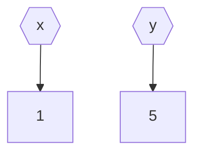
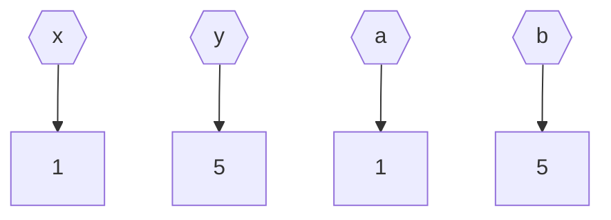
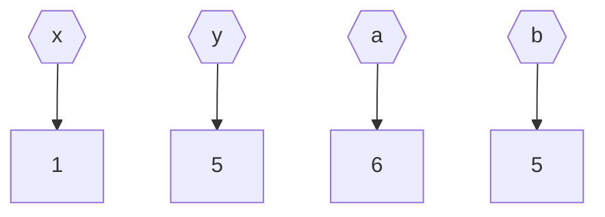
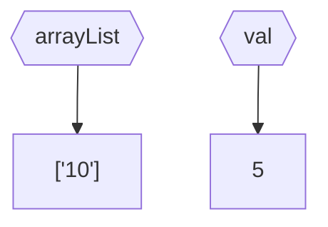
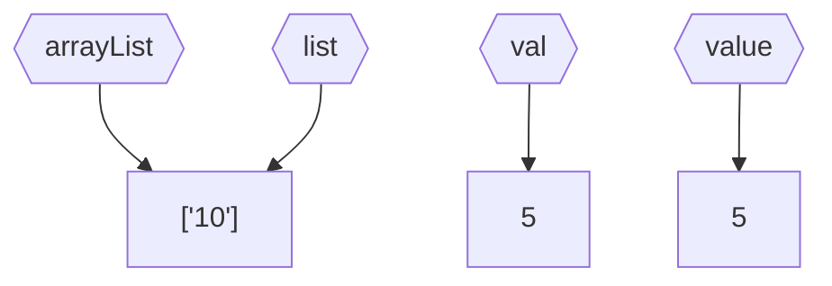
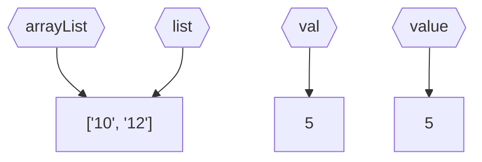
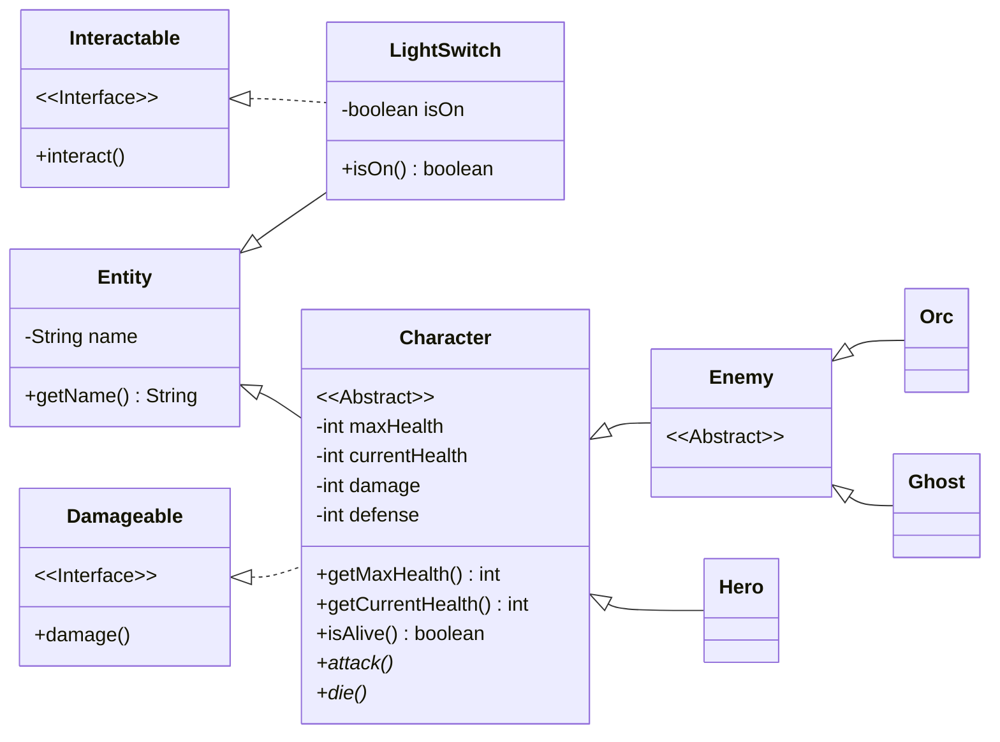

# Programmare in Java

Conoscere e gestire le peculiarità di Java.

<!-- New section -->

## Obiettivi

- Valore vs Riferimento
- Progetti con più file
- Polimorfismo
- Eccezioni
- Generics

<!-- New section -->

## Passaggio di parametri

Nella maggior parte dei casi, chiamare un metodo di una classe prevede anche il passaggio di un certo numero di parametri.

<!-- New subsection -->

### Passaggio per valore

Passare un parametro per valore crea una nuova variabile che ha lo stesso valore dell'originale.  
Le due variabili sono indipendenti.

Sono passati per valore tutti i tipi primitivi: **boolean**, **byte**, **char**, **short**, **int**, **long**, **float**, **double**

<!-- New subsection -->

#### Esempio: passaggio per valore

```java
public static int sum(int a, int b){
    a = a + b;
    return a;
}

public static void main(String args[]){
    int x = 1, y = 5;
    sum(x, y);
}
```

<div class="cols">



<!-- .element: class="fragment" -->



<!-- .element: class="fragment" -->



<!-- .element: class="fragment" -->

</div>

<!-- New subsection -->

### Passaggio per riferimento

Passare un parametro pre riferimento crea una nuova variabile che punta allo stesso oggetto di quella originale.  
Entrambe le variabili permettono di agire sullo stesso oggetto.

Sono passati per riferimento tutti gli oggetti.

<!-- New subsection -->

#### Esempio: passaggio per riferimento

```java
public static int appendIntAndGetSize(List<String> list, int value) {
    list.add(String.valueOf(value));
    return list.size();
}

public static void main(String[] args) {
    int val = 12;
    List<String> arrayList = new ArrayList<>();
    arrayList.add("10");
    appendIntAndGetSize(arrayList, val);
}
```

<div class="cols">



<!-- .element: class="fragment" -->



<!-- .element: class="fragment" -->



<!-- .element: class="fragment" -->

</div>

<!-- New section -->

## Lavorare con più classi

Le classi raggruppano dati e metodi in un unico blocco logico.  
Un progetto complesso conterrà un numero elevato di classi.

I design pattern sono una serie di regole che permettono di organizzare le classi in modo da avere un codice più pulito e mantenibile.

<!-- .element: class="fragment" -->

<!-- New subsection -->

### Suddividere le classi in package

La convenzione prevede che ogni file contenga una classe con lo stesso nome (ad eccezioni delle classi interne ad altre).

Le classi possono essere raggruppate in package.  
Un package è una cartella che contiene una serie di classi che rappresentano un aspetto del progetto.

<!-- .element: class="fragment" -->

<!-- New subsection -->

#### Esempio: suddividere le classi in package

<div class="cols">



```shell
src
├── Main.java
└── entity
    ├── Character.java
    ├── Damageable.java
    ├── Enemy.java
    ├── Entity.java
    ├── Ghost.java
    ├── Hero.java
    ├── Interactable.java
    ├── LightSwitch.java
    └── Orc.java
```

</div>

<!-- New subsection -->

### Compilazione ed esecuzione

```shell
javac Main.java
java Main
```

<!-- New subsection -->

### Creare un archivio JAR

Un archivio JAR è un file che contiene una serie di classi e risorse.  
Nel caso di progetti composti da più file, può essere utile creare un archivio JAR.

```shell
javac Main.java
jar cvfe Main.jar Main Main.class entity/*.class
```

<!-- .element: class="fragment" -->

<!-- New section -->

## Polimorfismo

Il polimorfismo è un concetto fondamentale della programmazione orientata agli oggetti.  
Un oggetto può essere visto in maniera diversa, più o meno generica, a seconda delle esigenze.

Ciò che permette di raggiungere questo risultato sono le meccaniche di ereditarietà e implementazione.

<!-- .element: class="fragment" -->

<!-- New subsection -->

### Utilizzare il polimorfismo: raggruppare

```java
List<Entity> entities = new ArrayList<>();
entities.add(new LightSwitch());
entities.add(new Orc());
entities.add(new Ghost());
```

Utilizzare la classe base permette di raggruppare gli oggetti in un'unica struttura.  
Questo perché, sebbene i tipi siano diversi, tutti derivano dalla stessa classe base.

<!-- New subsection -->

#### Utilizzare il polimorfismo: differenziare

```java
for (Entity entity : entities) {
    if (entity instanceof Interactable) {
        ((Interactable) entity).interact();
    }
    if (entity instanceof Damageable) {
        hero.attack((Damageable) entity);
    }
    if (entity instanceof Enemy) {
        Enemy enemy = (Enemy) entity;
        if (enemy.isAlive())
            enemy.attack(hero);
    }
}
```

È comunque possibile differenziare gli oggetti in base alle loro caratteristiche specifiche.  
Per farlo, è necessario effettuare un cast esplicito, assicurandosi che l'oggetto sia effettivamente di quel tipo con un'istruzione `instanceof`.

<!-- New section -->

## Eccezioni

Le eccezioni sono un meccanismo che permette di gestire gli errori in modo controllato.

In Java, le eccezioni sono oggetti che vengono lanciati quando si verifica un errore, interrompendo il flusso normale dell'esecuzione.

<!-- .element: class="fragment" -->

<!-- New subsection -->

### Gestire le eccezioni

```java
try {
    // ...
} catch (IOException | SQLException ex) {
    // ...
} finally {
    // ...
}
```

Le eccezioni possono essere gestite con un blocco `try-catch`.

Il blocco `try` contiene il codice che può generare un'eccezione.

<!-- .element: class="fragment" -->

Il blocco `catch` contiene il codice che viene eseguito solo se viene generata un'eccezione del tipo specificato.

<!-- .element: class="fragment" -->

Il blocco `finally` contiene il codice che viene eseguito in ogni caso.

<!-- .element: class="fragment" -->

<!-- New subsection -->

### Lanciare eccezioni

```java
throw new Exception("Something went wrong");
```

È possibile lanciare eccezioni con l'istruzione `throw` accompagnato da un oggetto che estende la classe `Exception`.

Se si vuole creare una nuova eccezione per un caso d'uso personalizzato, è possibile estendere la classe `Exception` o una delle sue sottoclassi.

<!-- .element: class="fragment" -->

<!-- New subsection -->

### Delegare la gestione delle eccezioni

```java
public void interact() throws Exception {
    throw new Exception("Something went wrong");
}
```

Normalmente, quando si maneggia del codice che può generare un'eccezione, è necessario gestirla all'interno del blocco `try-catch`.

Se invece si vuole delegare la gestione dell'eccezione, è possibile aggiungere la clausola `throws` al metodo, indicando il tipo di eccezione che può essere generata.

<!-- .element: class="fragment" -->

<!-- New subsection -->

### Try-with-resources

```java
try (BufferedReader reader = new BufferedReader(new FileReader("file.txt"))) {
    String line = reader.readLine()
    // ...
} catch (Exception e) {
    // ...
}
```

La struttura `try-with-resources` permette di gestire le risorse che vengono aperte all'interno di un blocco `try`.

Le risorse vengono automaticamente chiusa alla fine del blocco `try`, anche in caso di eccezioni.

<!-- .element: class="fragment" -->

<!-- New subsection -->

### Eccezioni: best practice

- **Be specific**: catturare eccezioni che sappiamo come gestire
- **Fail-fast**: notificare l'errore il prima possibile
- **Catch-late**: rimandare la gestione dell'errore al livello superiore
- **Logging**: registrare gli errori in un file di log
- **Custom exceptions**: creare eccezioni personalizzate per i casi d'uso specifici
- **Use judiciously**: evitare di usare eccezioni per il controllo del flusso

[Ulteriori dettagli](https://www.digitalocean.com/community/tutorials/exception-handling-in-java)

<!-- New section -->

## Generics

I generics sono un meccanismo che permette di creare classi e metodi parametrici, in grado di operare su tipi diversi.

<!-- New subsection -->

### Creare una classe generica

```java
public class Pair<K, V> {
    private K key;
    private V value;
    public Pair(K key, V value) {
        this.key = key;
        this.value = value;
    }
    public K getKey() {
        return key;
    }
    public V getValue() {
        return value;
    }
}
```

All'interno della definizione della classe, è possibile specificare uno o più tipi generici fra le parentesi angolate.

<!-- New subsection -->

### Utilizzare una classe generica

```java
public static void main(String[] args) {
    Pair<String, Integer> pair = new Pair<>("Hello", 42);
    System.out.println(pair.getKey());
    System.out.println(pair.getValue());
}
```

Nel momento in cui si crea un oggetto di una classe generica, è necessario specificare i tipi con cui si vuole utilizzare la classe.

<!-- New section -->

## Challenge

- Creare un wrapper per la lettura e scrittura di file
- Creare una struttura dati simile a Pair che permetta di memorizzare più di due elementi
- Creare un simulatore di gioco di ruolo molto semplice da riga di comando
