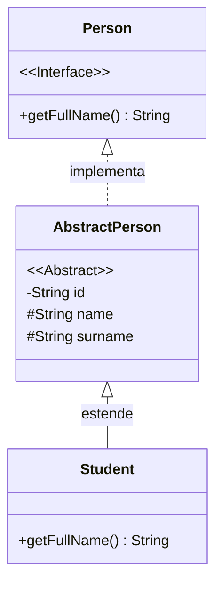
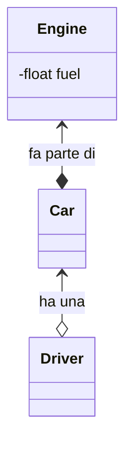
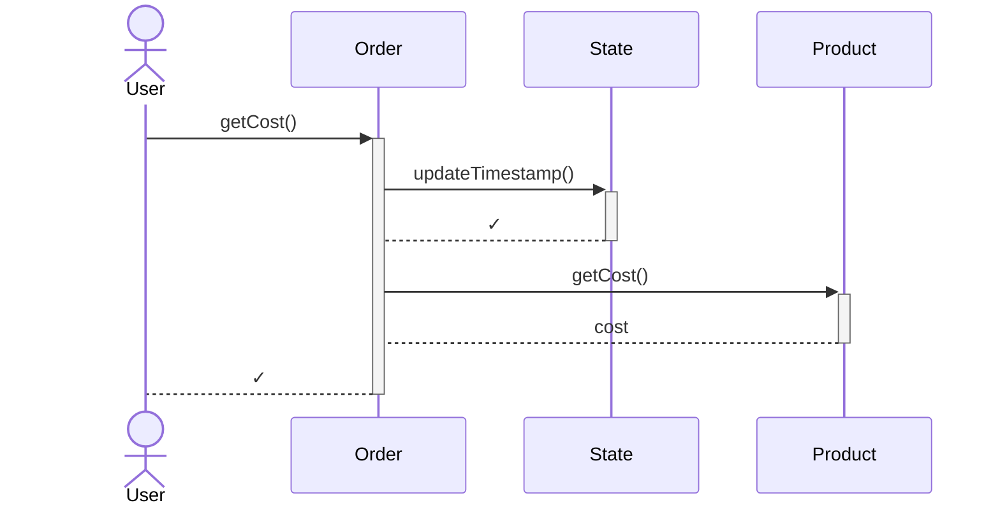

# UML

Diagrammi per la modellazione di sistemi software.

<!-- New section -->

## Obiettivi

- UML
- MermaidJs
- Diagrammi di classe
- Diagrammi di sequenza

<!-- New section -->

## Unified Modeling Language (UML)

L'UML è stato sviluppato da [Grady Booch](https://it.wikipedia.org/wiki/Grady_Booch), [Jim Rumbaugh](https://it.wikipedia.org/wiki/Jim_Rumbaugh) e [Ivar Jacobson](https://it.wikipedia.org/wiki/Ivar_Jacobson) all'interno della [Object Management Group](https://it.wikipedia.org/wiki/Object_Management_Group) (OMG) nel 1997.

L'UML nasce come linguaggio settoriale per la modellazione di sistemi complessi basato sul paradigma orientato agli oggetti.

<!-- .element: class="fragment" -->

Nel corso del tempo i diagrammi prodotti dall'UML sono andati a specializzarsi ulteriormente.  
Quelli che ci interessano sono i **diagrammi di classe** e i **diagrammi di sequenza**.

<!-- .element: class="fragment" -->

<!-- New section -->

## PlantUML

[PlantUML](https://plantuml.com/) è uno strumento molto potente e versatile per la creazione di diagrammi UML, realizzato in Java.

PlantUML permette l'export dei diagrammi in diversi formati, tra cui PNG, SVG, PDF e LaTeX.

<!-- .element: class="fragment" -->

Per poterlo utilizzare, si può optare per [un'installazione locale](https://plantuml.com/en-dark/starting), utilizzare il [server online](https://www.plantuml.com/plantuml/uml/) oppure utilizzare un [plugin per l'editor di testo](https://plantuml.com/en/running), come [quello per VsCode](https://marketplace.visualstudio.com/items?itemName=jebbs.plantuml).

<!-- .element: class="fragment" -->

<!-- New subsection -->

## MermaidJS

[MermaidJS](https://mermaidjs.github.io/) è una libreria JavaScript che permette di creare diagrammi UML direttamente nel browser, con una sintassi piuttosto semplice.

Grazie alla facilità con cui è possibile integrarla in un qualsiasi sito web, è supportata dalla maggior parte degli editor Markdown.
Persino GitHub supporta la sintassi MermaidJS nella visualizzazione dei file Markdown, come i README.

<!-- .element: class="fragment" -->

In questo corso utilizzeremo MermaidJS per creare i diagrammi UML, ma la sintassi è abbastanza simile, e a tratti compatibile, a quella di PlantUML.

<!-- .element: class="fragment" -->

<!-- New section -->

## Diagrammi di classe

I diagrammi di classe rappresentano la gerarchia fra le classi del programma.

Può essere usato per indicare:

<!-- .element: class="fragment" data-fragment-index="1" -->

- **implementazione** (interfaccia -> classe)
- **estensione** (superclasse -> sottoclasse)
- **composizione** (_parte di_)
- **aggregazione** (_ha un_)

<!-- .element: class="fragment" data-fragment-index="1" -->

[Ulteriori dettagli](https://mermaid.js.org/syntax/classDiagram.html)

<!-- .element: class="fragment" data-fragment-index="2" -->

<!-- New subsection -->

### Diagrammi di classe: codice 1

```java
interface Person {
    public String getFullName();
}
```

```java
abstract class AbstractPerson implements Person{
    private String id;
    protected String name;
    protected String surname;
}
```

```java
class Student extends Person {
    public String getFullName() {
        return this.name + " " + this.surname;
    }
}
```

<!-- New subsection -->

### Diagrammi di classe: diagramma 1

<div class="cols">

```
classDiagram

    class Person {
        <<Interface>>
        +getFullName() String
    }
    class AbstractPerson {
        <<Abstract>>
        -String id
        #String name
        #String surname
    }
    class Student {
        +getFullName() String
    }

    Person <|.. AbstractPerson
    AbstractPerson <|-- Student

```



</div>

<!-- New subsection -->

### Diagramma di classe: codice 2

```java
class Car {
    private Engine engine;
}
```

```java
class Engine {
    private float fuel;
}
```

```java
class Driver {
    private Car car;
}
```

<!-- New subsection -->

### Diagramma di classe: diagramma 2

<div class="cols">

```
classDiagram

    class Car
    class Driver
    class Engine {
        -float fuel
    }

    Engine <--* Car : fa parte di
    Car <--o Driver : ha una
```



</div>

<!-- New subsection -->

## Diagramma di sequenza

I diagrammi di sequenza mostrano le interazioni che avvengono fra gli oggetti, permettendo di tracciare la causalità degli eventi.

È possibile enumerare anche i possibili branch dell'esecuzione, i risultati restituiti dalle funzioni e i periodi in cui l'oggetto sta contribuendo attivamente.

<!-- .element: class="fragment" -->

[Ulteriori dettagli](https://mermaid.js.org/syntax/sequenceDiagram.html)

<!-- .element: class="fragment" -->

<!-- New subsection -->

### Diagrammi di sequenza: codice

```java
class Product {
    private float cost;
    public float getCost() { return product.getCost(); }
}
```

```java
class State {
    public long timestamp;

    public updateTimestamp() { System.currentTimeMillis() / 1000L; }
}
```

```java
class Order {
    private Product product;
    private State state;

    public float getCost() {
        state.updateTimestamp();
        return product.getCost();
    }
    public void updateTimestamp() { state.updateTimestamp(); }
}
```

<!-- New subsection -->

### Diagrammi di sequenza: diagramma

<div class="cols">

```
sequenceDiagram

    actor User;

    User ->>+ Order : getCost()
    Order ->>+ State : updateTimestamp()
    State -->- Order : #10003;
    Order ->>+ Product : getCost()
    Product -->- Order : cost
    Order -->- User : #10003;
```



</div>

<!-- New section -->

## Challenge

- Produrre un diagramma UML di classe per una challenge vista in precedenza
- Produrre un diagramma UML di sequenza per alcune delle chiamate più importanti che caratterizzano una challenge vista in precedenza
- Utilizzare gli altri diagrammi messi a disposizione da MermaidJs
- Installare ed utilizzare PlantUML
