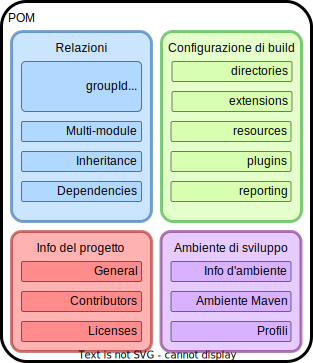
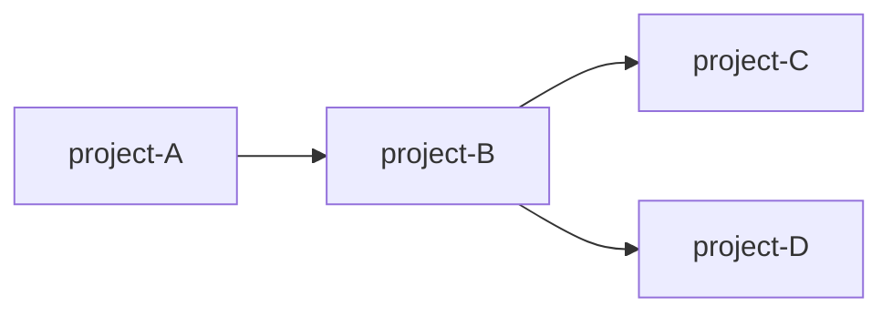
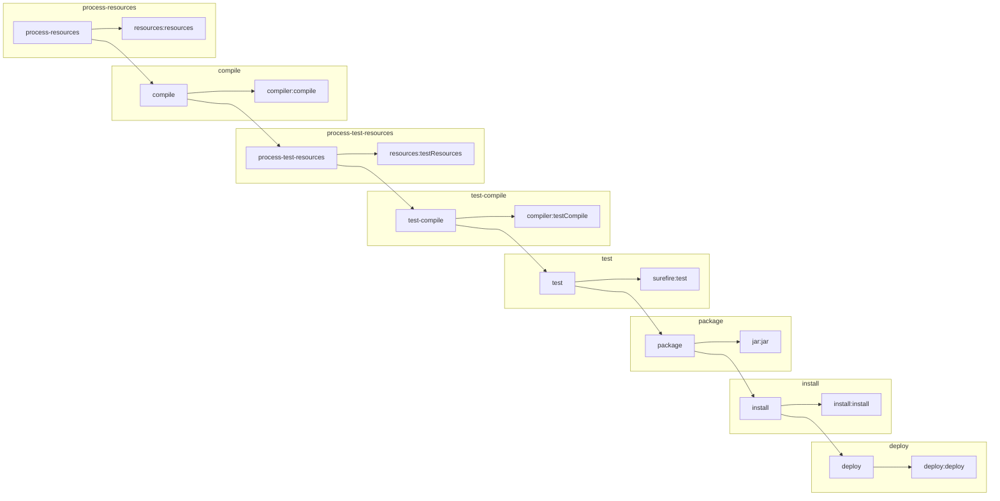

# Maven

Il build automation tool più famoso.

<!-- New section -->

## Cosa è Maven?


[Maven](https://maven.apache.org/) è un software che permette di automatizzare il processo di build di un progetto basato su Java.

Nato sotto l'egida dell'[Apache Software Foundation](https://it.wikipedia.org/wiki/Apache_Software_Foundation), ha come obiettivo quello di semplificare la gestione dello sviluppo software.

<!-- .element: class="fragment" -->

<!-- New subsection -->

### Perché è utilizzato?

Abbiamo visto che, non appena un progetto software inizia ad includere più file o persino delle dipendenze esterne, il processo di compilazione inizia a diventare sempre più complesso.  
Questo senza nemmeno considerare fattori come il testing, la distribuzione degli artefatti, la gestione delle versioni, la documentazione, la manipolazione del bytecode e così via.

Affinché il processo di build sia sempre riproducibile, bisogna quindi definire una sequenza di step standardizzata.  
Anche in questo caso, poter definire tutti i dettagli in un file con un formato noto è praticamente una necessità.

<!-- .element: class="fragment" -->

<!-- New subsection -->

### Obiettivi di Maven

- Rendere quanto più indolore possibile il processo di build
- Fornire un build system uniforme e riproducibile
- Gestire le dipendenze
- Fornire informazioni di qualità sullo stato del progetto
- Favorire l'utilizzo di best practices nel processo di sviluppo

<!-- New section -->

## Primi passi con Maven

Per poter utilizzare Maven, è necessario scaricandolo dal [sito ufficiale](https://maven.apache.org/download.cgi) ed [installarlo](https://maven.apache.org/install.html) o utilizzare il proprio gestore di pacchetti preferito.

Per assicurarci che l'installazione sia avvenuta con successo, si può controllare l'output del comando

<!-- .element: class="fragment" data-fragment-index="1" -->

```shell
mvn --version
```

<!-- .element: class="fragment" data-fragment-index="1" -->

Un help tooltip è disponibile con il comando

<!-- .element: class="fragment" data-fragment-index="2" -->

```shell
mvn -h
```

<!-- .element: class="fragment" data-fragment-index="2" -->

<!-- New subsection -->

### Iniziare un progetto

Per iniziare un nuovo progetto, è sufficiente creare una cartella e lanciare il comando

```shell
mvn archetype:generate \
-DarchetypeArtifactId=maven-archetype-quickstart -DarchetypeVersion=1.4
```

Il programma chiederà di inserire ulteriori informazioni:

<!-- .element: class="fragment" data-fragment-index="1" -->

- **groupId**: identificativo univoco (dominio) dell'organizzazione o sviluppatore
- **artifactId**: nome del progetto e della cartella che lo conterrà
- **version**: versione del progetto
- **package**: tipo di packaging (jar, war, ear, pom, rar, ejb)

<!-- .element: class="fragment" data-fragment-index="1" -->

<!-- New subsection -->

### Struttura del progetto

Una volta creato il progetto, la struttura della cartella sarà la seguente:

```shell
.
├── pom.xml # file di configurazione per Maven
└── src
    ├── main
    │   ├── java
    │   │   └── edu
    │   │       └── tend
    │   │           └── App.java # codice sorgente
    │   └── resources
    └── test
        ├── java
        │   └── edu
        │       └── tend
        │           └── AppTest.java # test
        └── resources
```

<!-- New section -->

## Project Object Model (POM)

<div class="cols">

Il file `pom.xml` è un file xml che serve a configurare il comportamento di Maven.

</div>



<!-- New subsection -->

### Elementi necessari

Vi sono un numero spropositato di possibili configurazione utilizzabili.  
Quelle necessarie, però, sono solo:

- **modelVersion**: versione del pom
- **groupId**: identificativo univoco (dominio) dell'organizzazione o sviluppatore
- **artifactId**: nome del progetto e della cartella che lo conterrà
- **version**: package usato dal progetto. Spesso corrisponde al groupId

```xml
<project>
    <modelVersion>4.0.0</modelVersion>
    <groupId>edu.tend</groupId>
    <artifactId>maven-1</artifactId>
    <version>1</version>
</project>
```

<!-- New subsection -->

### Estensibilità del POM

Per estendere esplicitamente un pom, magari da un sotto-modulo, si può utilizzare il tag `<parent>`:

```xml
<project>
    <modelVersion>4.0.0</modelVersion>
    <parent>
        <groupId>edu.tend</groupId>
        <artifactId>maven-1</artifactId>
        <version>1</version>
        <!-- <relativePath>../original/pom.xml</relativePath> -->
    </parent>
    <artifactId>maven-module</artifactId>
</project>
```

La combinazione di `groupId`, `artifactId` e `version` prende il nome di **coordinate**.

<!-- .element: class="fragment" -->

Tutti i progetti derivano implicitamente da un pom di default.

<!-- .element: class="fragment" -->

<!-- New subsection -->

### Variabili

Per definire delle variabili, si può utilizzare il tag `<properties>`.

```xml
<project>
    <!-- ... -->
    <properties>
        <project.build.sourceEncoding>UTF-8</project.build.sourceEncoding>
        <maven.compiler.source>1.8</maven.compiler.source>
        <maven.compiler.target>1.8</maven.compiler.target>
        <la.mia.variabile>valore</la.mia.variabile>
    </properties>
</project>
```

Alcune variabili speciali sono già definite, come ad esempio

<!-- .element: class="fragment" data-fragment-index="1" -->

- **project.basedir**: la cartella del progetto
- **maven.build.timestamp**: il timestamp in cui avviene la build (UTC)
- **env.PATH**: la variabile d'ambiente PATH

<!-- .element: class="fragment" data-fragment-index="1" -->

<!-- New subsection -->

### Utilizzare le variabili

Le variabili possono essere referenziate con la sintassi `${nome.variabile}`.

```xml
<project>
    <!-- ... -->
    <properties>
        <mavenVersion>3.6.3</mavenVersion>
    </properties>
    <dependencies>
        <dependency>
            <groupId>org.apache.maven</groupId>
            <artifactId>maven-artifact</artifactId>
            <version>${mavenVersion}</version>
        </dependency>
    </dependencies>
</project>
```

Alcune variabili con nomi specifici potrebbero essere utilizzate implicitamente da plugin o da altri elementi del pom.

<!-- .element: class="fragment" -->

<!-- New subsection -->

### Dipendenze

Uno degli aspetti più comodi di Maven è la gestione automatica delle dipendenze del progetto.
Per indicare una o più dipendenze, si può utilizzare il tag `<dependencies>`.

```xml
<project>
    <!-- ... -->
    <dependencies>
        <dependency>
            <groupId>junit</groupId>
            <artifactId>junit</artifactId>
            <version>4.11</version>
            <scope>test</scope>
        </dependency>
        <dependency>
            <groupId>org.apache.maven</groupId>
            <artifactId>maven-artifact</artifactId>
            <version>${mavenVersion}</version>
        </dependency>
    </dependencies>
</project>
```

<!-- New subsection -->

#### Dipendenze: scope

Lo scope indica il contesto in cui la dipendenza è utilizzata, se e quando deve essere inclusa e in quali fasi di build del progetto.

I possibili valori sono:

<!-- .element: class="fragment" data-fragment-index="1" -->

- **compile**: dipendenza di default. Viene inclusa in tutte le fasi di build.
- **provided**: dipendenza che ci si aspetta sarà fornita a runtime, ma necessaria per la compilazione
- **runtime**: dipendenza utilizzata solo in runtime, ma non in compilazione.
- **test**: dipendenza utilizzata solo in fase di test.
- **system**: dipendenza fornita dal sistema per cui è necessario indicare il path del jar.

<!-- .element: class="fragment" data-fragment-index="1" -->

<!-- New subsection -->

#### Dipendenze: versione

Per indicare la versione di una dipendenza, si utilizza il tag `<version>`.  
Si può anche specificare un range accettabile di versioni, dove `[]` indica inclusione e `()` esclusione.

```xml
<project>
    <!-- ... -->
    <dependencies>
        <dependency>
            <groupId>junit</groupId>
            <artifactId>junit</artifactId>
            <version>[3.0,4.11)</version>
            <scope>test</scope>
        </dependency>
    </dependencies>
</project>
```

<!-- New subsection -->

#### Dipendenze: transitività

Maven gestisce le dipendenze in maniera transitiva.
Se `B` dipende da `C` e `D`, nel momento in cui `A` utilizza `B`, Maven si occuperà di aggiungere implicitamente le dipendenze di `B`.



Se si vuole dare maggiore libertà di scelta sulla specifica dipendenza all'utente finale, è possibile aggiungere nella dipendenza il tag `<optional>true</optional>`.

<!-- New section -->

## Lifecycle

Maven organizza gli step di build in una serie di fasi, la cui sequenza prende il nome di **lifecycle**.

I tre lifecycle principali sono:

<!-- .element: class="fragment" data-fragment-index="1" -->

- **default**: lifecycle di default, che include le fasi `validate`, `compile`, `test`, `package`, `verify`, `install` e `deploy`.
- **clean**: lifecycle che include la fase `clean`, che rimuove tutti i file generati dalla build.
- **site**: lifecycle che include la fase `site`, che genera il sito di documentazione del progetto.

<!-- .element: class="fragment" data-fragment-index="1" -->

<!-- New subsection -->

### Fasi

Come un lifecycle è una sequenza di fasi, una fase è una sequenza di goal.

Quando viene invocata una fase, Maven esegue tutte le fasi precedenti nel lifecycle, e per ciascuna fase esegue i goal corrispondenti.

<!-- .element: class="fragment" -->

<!-- New subsection -->

### Goal

Un goal è un task specifico che viene eseguito da Maven quando si arriva alla fase corrispondente, ma possono anche essere lanciati singolarmente.

I goal sono definiti dai plugin e ne prendono il nome:

<!-- .element: class="fragment" data-fragment-index="1" -->

- `maven-compiler-plugin:compile`
- `maven-surefire-plugin:test`

<!-- .element: class="fragment" data-fragment-index="1" -->

<!-- New subsection -->

#### Default lifecycle



<!-- New subsection -->

#### Plugin

Un plugin forniscono un insieme di goal che per Maven.  
Per aggiungere un plugin al progetto, si utilizza il tag `<plugin>`.

```xml
<project>
    <!-- ... -->
    <build>
        <plugins>
            <plugin>
                <groupId>org.apache.maven.plugins</groupId>
                <artifactId>maven-compiler-plugin</artifactId>
                <version>3.8.1</version>
                <configuration>
                    <source>1.8</source>
                </configuration>
            </plugin>
        </plugins>
    </build>
</project>
```

<!-- New subsection -->

## Distribuzione

Maven permette di specificare una repository remota dove caricare il progetto per essere distribuito.

```xml
<project>
    <!-- ... -->
    <distributionManagement>
        <repository>
            <id>github</id>
            <name>GitHub Packages</name>
            <url>https://maven.pkg.github.com/User/Project</url>
        </repository>
    </distributionManagement>
</project>
```

Il repository remoto richiederà delle credenziali per potervi accedere.
Queste vanno specificate nel file `~/.m2/settings.xml`.

<!-- .element: class="fragment" data-fragment-index="1" -->

[Ulteriori dettagli](https://maven.apache.org/plugins/maven-deploy-plugin/usage.html)

<!-- .element: class="fragment" data-fragment-index="1" -->

<!-- New section -->

## Challenge

- Creare un progetto Maven
- Creare una test suite per il progetto
- Utilizzare un sistema come le Github Actions per distribuire il progetto
