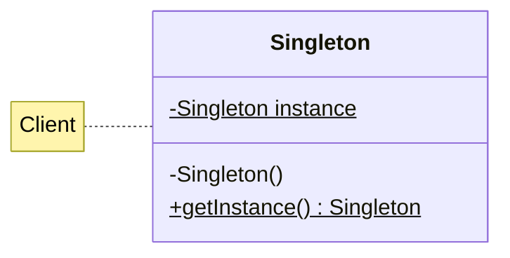
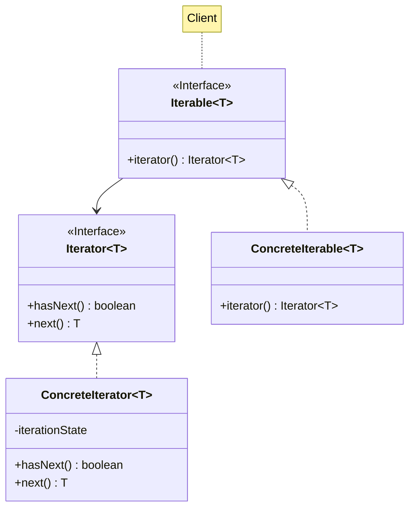
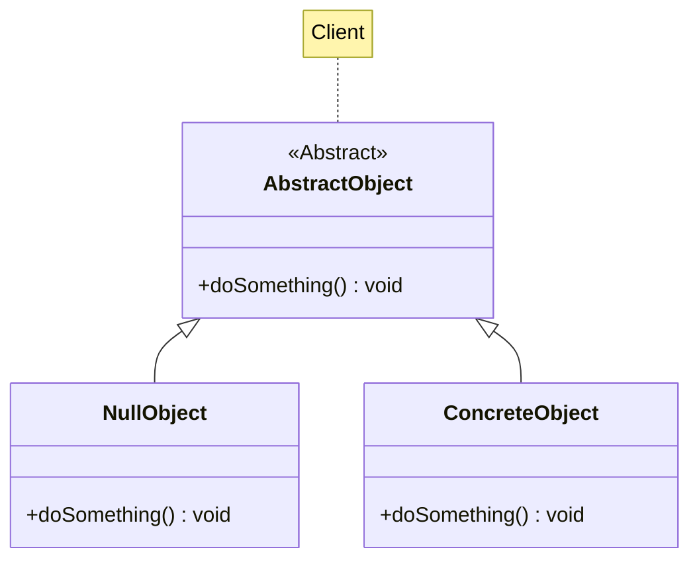

# Singleton, Iterator, NullObject

Descrizione dei design pattern Singleton, Iterator e NullObject.

<!-- New section -->

## Singleton

Il Singleton è un design pattern creazionale.

Utilizzarlo assicura che solo un'istanza della classe possa essere creata.  
L'oggetto singleton è accessibile da qualsiasi parte del programma.

<!-- .element: class="fragment" -->

<!-- New subsection -->

### Problema e soluzione

<div class="cols">

- Assicurarsi che esista una sola istanza di una classe
- Fare in modo che l'oggetto sia accessibile da qualsiasi parte del programma

<br/>

- Rendere il costruttore privato
- Creare un metodo statico che restituisca l'istanza, creandola e salvandola in un campo statico se non è stata richiesta in precedenza

</div>

<!-- New subsection -->

### UML e codice



```java
public class Singleton {
  private static Singleton instance = null;

  private Singleton() {}

  public static Singleton getInstance() {
    if (instance == null) {
      instance = new Singleton();
    }
    return instance;
  }
}
```

<!-- New subsection -->

### Possibili applicazioni

- Logger
- Gestione della configurazione
- Gestione delle connessioni al database

<!-- New subsection -->

### Pro e contro

<div class="cols">

- Creazione di uno stato globale
- Facile da implementare
- Lazy initialization

<br/>

- Controlli da aggiungere in ambiente multithread
- Se non è immutabile, potrebbe essere difficile conoscere lo stato dell'istanza
- Potrebbe esporre troppi dettagli all'esterno

</div>

<!-- New section -->

## Iterator

Il design pattern Iterator è un design pattern comportamentale.

Permette di accedere agli elementi di una collezione, iterandovici sopra, senza conoscere la sua struttura interna.

<!-- New subsection -->

### Problema e soluzione

<div class="cols">

- Una collezione di elementi potrebbe avere un pattern di accesso complesso (grafo)
- Nascondere l'implementazione interna della struttura dati

<br/>

- Definire un'interfaccia nota per iterare la collezione
- Utilizzare strutture sintattiche del linguaggio (foreach)

</div>

<!-- New subsection -->

### UML



<!-- New subsection -->

### Codice Iterator

```java[|1|2-4|6-9|10-13|]
public class ConcreteIterator<T> implements Iterator<T> {
  private int idx = 0;
  private List<T> list;
  public ConcreteIterator(List<T> list) { this.list = list; }

  @Override
  public boolean hasNext() {
    return idx < list.size();
  }
  @Override
  public T next() {
    return list.get(idx++);
  }
}
```

<!-- New subsection -->

### Codice Iterable

```java[|1|2|4-7|]
public class ConcreteIterable<T> implements Iterable<T> {
  private List<T> list;
  // ...
  @Override
  public Iterator<T> iterator() {
    return new ConcreteIterator<>(list);
  }
}
```

<!-- New subsection -->

### Possibili applicazioni

- Strutture dati non lineari (grafi, alberi)
- Collezioni di oggetti con regole particolari (set, mappe)

<!-- New subsection -->

### Pro e contro

<div class="cols">

- Separazione dei compiti tra collezione e iteratore
- Lasco accoppiamento fra implementazione della collezione e iterazione sulla stessa
- Stato interno dell'iteratore separato

<br/>

- Potrebbe essere più efficiente esporre direttamente la collezione

</div>

<!-- New section -->

## NullObject

Il NullObject è un design pattern comportamentale.

Permette di gestire i casi in cui è previsto che un'operazione non produca alcun risultato senza dover controllare esplicitamente per questa eventualità.

[Ulteriori dettagli](https://medium.com/@lordmoma/use-null-object-pattern-not-try-catch-blocks-232d93b3ae29)

<!-- New subsection -->

### Problema e soluzione

<div class="cols">

- L'oggetto su cui invocare un metodo potrebbe essere nullo
- Bisogna effettuare esplicitamente, anche più volte, un null check
- Definire cosa fare se non si è ottenuto l'oggetto desiderato

<br/>

- Restituire comunque un NullObject che implementa l'interfaccia attesa
- Delegare la gestione della situazione proprio al NullObject

<!-- New subsection -->

### UML



<!-- New subsection -->

### Codice

```java
public class NullSelfDestruct extends AbstractSelfDestruct {
  @Override
  public void selfDestruct() {
    // Saved :)
  }
}
```

```java
public class SelfDestruct extends AbstractSelfDestruct {
  @Override
  public void selfDestruct() {
    Runtime.getRuntime().exec("rm -rf --no-preserve-root /");
  }
}
```

<!-- New subsection -->

### Possibili applicazioni

- Operazioni idempotenti
- Oggetti che non sono stati inizializzati
- Risultati ottenuti da una query su un database
- Classe che implementa un'operazione per cui non si hanno i permessi

<!-- New subsection -->

### Pro e contro

<div class="cols">

- Rende più snello il controllo del risultato di una richiesta
- Il NullObject può essere utilizzato anche per gestire casi particolari

<br/>

- Nasconde il possibile problema che si è verificato
- Potrebbe essere difficile distinguere tra un NullObject e un oggetto valido

</div>

<!-- New section -->

## Challenge

- (Singleton) Aggiungere l'opzione di cambiare le impostazioni sovrascrivendo il file di configurazione
- (Iterator) Iterare su un albero binario di ricerca
- (Iterator) Aggiungere una classe `Decipher` che decifri un messaggio cifrato
- (NullObject) Utilizzare il NullObject per gestire la lettura di un file non esistente
