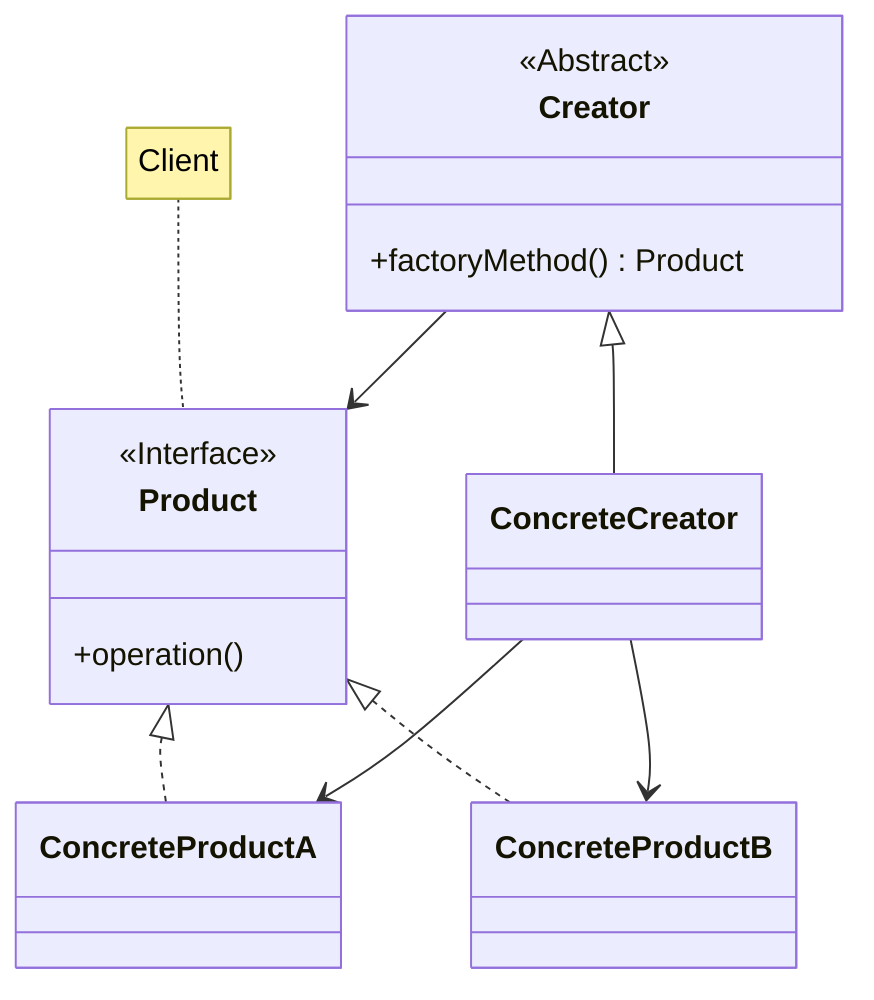
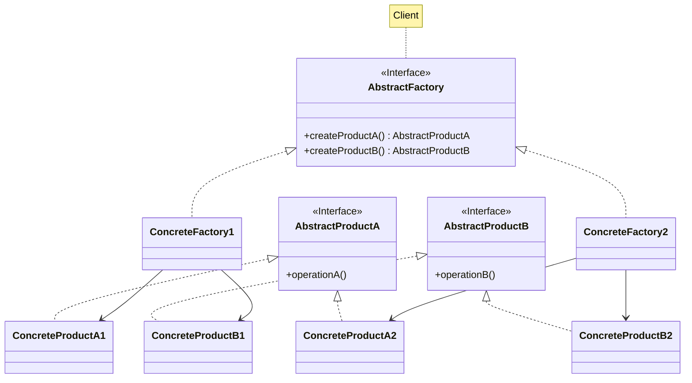

# Factory method, Abstract factory

Descrizione dei design pattern Factory method, Abstract factory.

<!-- New section -->

## Factory method

Il design pattern Factory method è un design pattern creazionale.

Definisce un'interfaccia per la creazione di oggetti, delegando alle sottoclassi il compito di decidere quale tipo di oggetto istanziare.

<!-- New subsection -->

### Problema e soluzione

<div class="cols">

- Il client non dovrebbe conoscere i tipi esatte e le dipendenze necessarie per svolgere operazioni che non gli competono
- Possibilità di aggiungere componenti in maniera trasparente
- Controllo centralizzato della creazione degli oggetti

<br/>

- Delegare la creazione degli oggetti ad un apposito factory method che può essere sovrascritto dalle sottoclassi
- Possibilità di aggiungere in qualsiasi momento sottoclassi specializzate
- La classe factory si può occupare di contare le risorse create e riallocarle

</div>

<!-- New subsection -->

### UML



<!-- New subsection -->

### Codice

```java
// ConcreteCreator
public class ConcreteNumberCreator extends NumberCreator {
  @Override
  public Product factoryMethod(int number) {
    if ((number & 1) == 0)
      return new EvenNumber();
    else
      return new OddNumber();
  }
}
```

```java
// ConcreteProductA
public class OddNumber implements Number {
  @Override
  public boolean isEven() { return false; }
}
// ConcreteProductB
public class EvenNumber implements Number {
  @Override
  public boolean isEven() { return true; }
}
```

<!-- New subsection -->

### Possibili applicazioni

- Creazione di elementi di UI con stili differenti
- Leggere da sorgenti diverse

<!-- New subsection -->

### Pro e contro

<div class="cols">

- Nasconde la specializzazione di un interfaccia
- Permette di gestire in maniera centralizzata la creazione di oggetti
- Possibilità di aggiungere in qualsiasi momento sottoclassi senza complicare il client

<br/>

- Gerarchia di classi più complessa

</div>

<!-- New section -->

## Abstract factory

Il design pattern Abstract factory è un design pattern creazionale.

Definisce un’interfaccia per creare famiglie di oggetti che hanno qualche relazione senza specificare le loro classi concrete.

<!-- New subsection -->

### Problema e soluzione

<div class="cols">

- Il client deve essere indipendente dalle classi utilizzate
- Creazione di una serie di oggetti in maniera consistente

<br/>

- Lasciare che il factory si occupi di creare oggetti della stessa famiglia
- Le sottoclassi del factory si specializzano in una famiglia specifica

</div>

<!-- New subsection -->

### UML



<!-- New subsection -->

### Codice Product

```java
// ConcreteProductA1
public class CircleMinimize implements Shape {
  @Override
  public String draw() { return "(_)" }
}
// ConcreteProductA2
public class CircleClose implements Shape {
  @Override
  public String draw() { return "(X)" }
}
```

```java
// ConcreteProductB1
public class SquareMinimize implements Shape {
  @Override
  public String draw() { return "[_]" }
}
// ConcreteProductB2
public class SquareClose implements Shape {
  @Override
  public String draw() { return "[X]" }
}
```

<!-- New subsection -->

### Codice factory

```java
// ConcreteFactoryA
public class CircleCreator implements Creator {
  @Override
  public Shape getMinimize() { return new CircleMinimize(); }
  @Override
  public Shape getClose() { return new CircleClose(); }
}
```

```java
// ConcreteFactoryB
public class SquareCreator implements Creator {
  @Override
  public Shape getMinimize() { return new SquareMinimize(); }
  @Override
  public Shape getClose() { return new SquareClose(); }
}
```

<!-- New subsection -->

### Possibili applicazioni

- Creazione di elementi di UI con stili differenti
- Sistemi di internazionalizzazione

<!-- New subsection -->

### Pro e contro

<div class="cols">

- Certezza di produrre prodotti coerenti fra di loro
- La creazione degli oggetti è centralizzata
- Possibilità di aggiungere in qualsiasi momento sottoclassi senza complicare il client

<br/>

- Gerarchia di classi più complessa

</div>

<!-- New section -->

## Challenge

- (Factory method) Gestione di più figure geometriche in base al numero di lati e/o angoli
- (Abstract factory) Supportare un menù multilingua con un apposito AbstractFactory