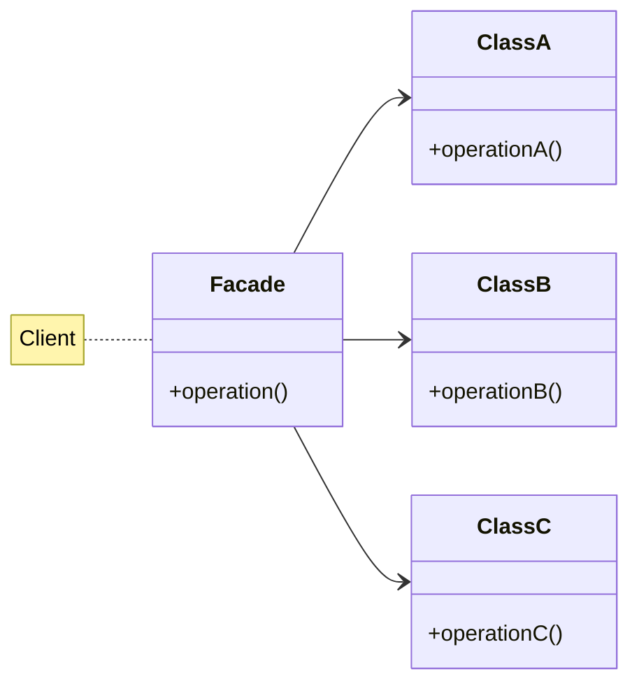
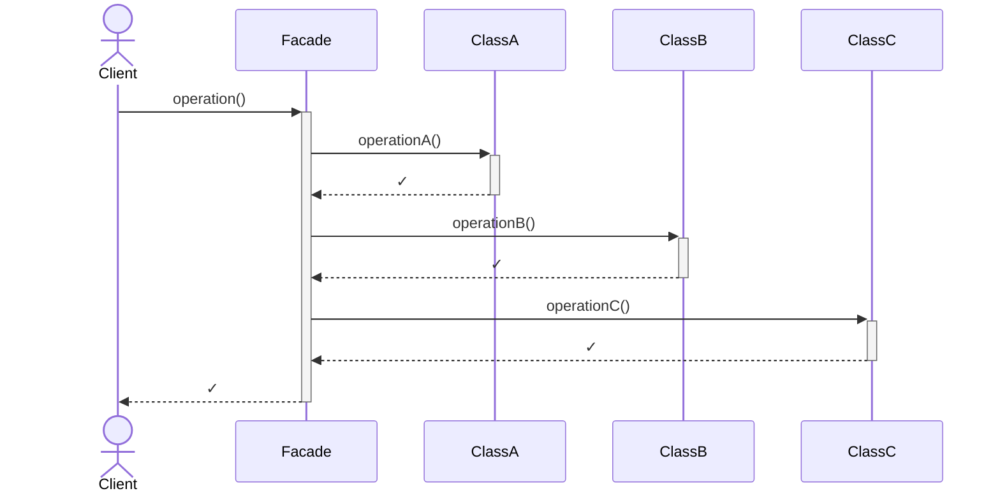
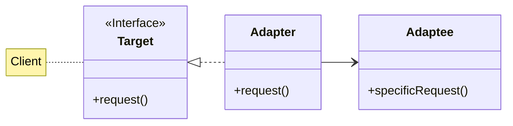
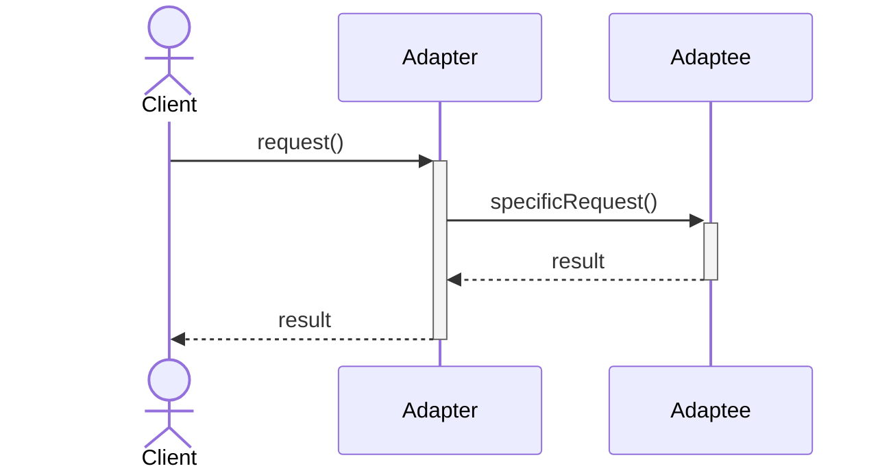
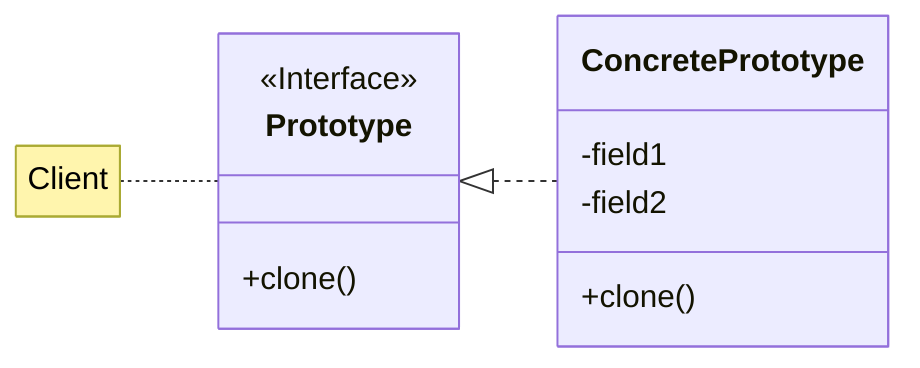
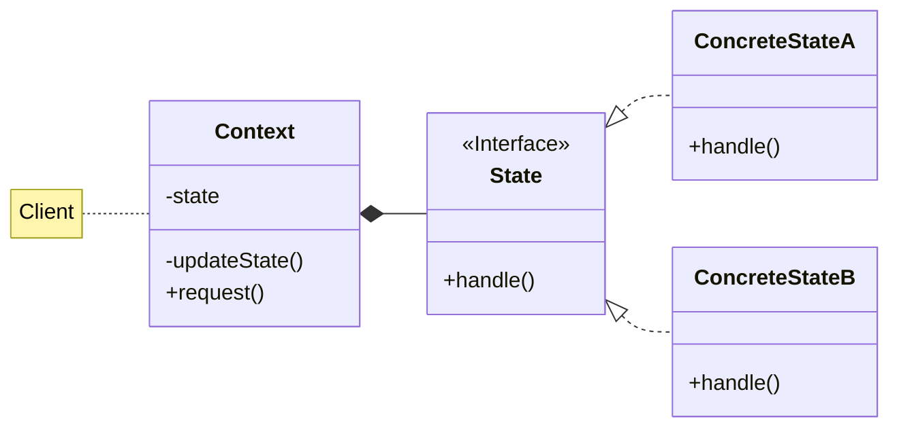
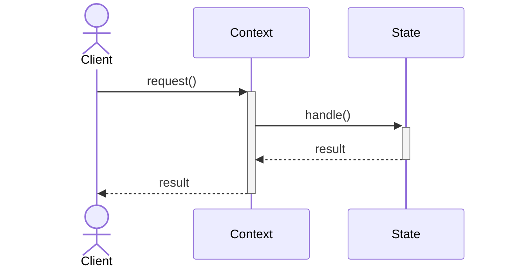

# Facade, Adapter, Prototype, State

Descrizione dei design pattern Facade, Adapter, Prototype e State.

<!-- New section -->

## Facade

Il facade è un design pattern strutturale.

Definisce un'interfaccia semplificata verso una libreria, un framework o qualsiasi altro sistema complesso.

<!-- New subsection -->

### Problema e soluzione

<div class="cols">

- Compiere una macro operazione richiede molte chiamate a metodi di diverse classi
- Le operazioni di basso livello dovrebbero essere nascoste al client che non le deve utilizzare

<br/>

- Il facade fornisce un'interfaccia semplificata che raggruppa internamente le sotto-operazioni
- Vengono esposti solo i metodi che interessano al client

</div>

<!-- New subsection -->

### UML



<!-- New subsection -->

### Diagramma di sequenza



<!-- New subsection -->

### Codice

```java
public class VideoConverter {
    public VideoFile convert(String inputFile, Codec codec) {
        VideoFile file = new VideoFile(inputFile);
        Codec ogCodec = file.getCodec();
        Converter converter = new Converter(ogCodec, codec);
        return converter.convert(file);
    }
}
```

<!-- New subsection -->

### Possibili applicazioni

- Creare un'interfaccia di alto livello per un sistema complesso
- Nascondere una serie di richieste REST
- Nascondere una serie di query ad un database

<!-- New subsection -->

### Pro e contro

<div class="cols">

- Rende più semplice l'utilizzo di un sistema complesso

<br/>

- Se il facade inizia a nascondere troppe sotto-operazioni, viola il principio di responsabilità singola

</div>

<!-- New section -->

## Adapter

L'adapter è un design pattern strutturale.

Agevola l'interoperabilità tra interfacce diverse.

<!-- New subsection -->

### Problema e soluzione

<div class="cols">

- È necessario cambiare una dipendenza, cercando di minimizzare le modifiche al codice esistente
- L'api esterna non è direttamente compatibile con le interfacce del sistema

<br/>

- Nascondere le interfacce indesiderate dietro un oggetto adapter
- Sarà compito dell'adapter tradurre le richieste del client in chiamate comprensibili all'api esterna

</div>

<!-- New subsection -->

### UML e diagramma di sequenza



<br/>
<br/>



<!-- New subsection -->

### Codice

```java
// JSList<T> è l'interfaccia target, JSListAdapter<T> è l'adapter
public class JSListAdapter<T> implements JSList<T> {

    // List è l'adaptee
    private List<T> list;

    public JSListAdapter(List<T> list) { this.list = list; }

    public int length() { return list.size(); }

    public T at(int index) { return list.get(index); }

    public void push(T item) { list.add(item); }
}
```

<!-- New subsection -->

### Varianti

#### Adapter a due vie

Nell'adapter a due vie, l'adapter, oltre l'interfaccia target, implementa anche quella dell'adaptee.
Può essere utilizzato sia come adapter che come adaptee.

#### Class adapter vs Object adapter

Nel class adapter, l'adapter estende l'adaptee.  
Nell'object adapter, l'adapter contiene un'istanza dell'adaptee.

<!-- New subsection -->

### Possibili applicazioni

- Tradurre le richieste di un client in chiamate comprensibili ad un'api esterna
- Cambiare una libreria esterna senza modificare il codice del client
- Semplificare un interfaccia limitandosi a mostrare solo le funzionalità che interessano al client

<!-- New subsection -->

### Pro e contro

<div class="cols">

- Minore dipendenza da una specifica interfaccia
- Aggiunta di controlli e validazioni personalizzati sulle richieste

<br/>

- Possibile peggioramento delle prestazioni

</div>

<!-- New section -->

## Prototype

Il prototype è un design pattern creazionale.

Permette di creare nuovi oggetti clonandone uno esistente.

<!-- New subsection -->

### Problema e soluzione

<div class="cols">

- È necessario creare un oggetto con lo stesso stato di un altro già esistente
- Bisogna includere anche campi privati e protetti
- È necessario assicurarsi che eventuali riferimenti diventino indipendenti

<br/>

- Delegare all'oggetto stesso la sua clonazione
- Assicurarsi che la clonazione sia profonda

</div>

<!-- New subsection -->

### UML



<!-- New subsection -->

### Codice

```java
public class User implements Cloneable {
    private String name;
    private int age;
    private Address address;
    @Override
    public User clone() {
        User clone = (User) super.clone();
        clone.address = this.address.clone();
        return clone;
    }
}
```

In java tutti gli oggetti possiedono un metodo `clone()`.  
Per poterlo utilizzare però, bisogna implementare l'interfaccia `Cloneable` e cambiare la visibilità del metodo a `public`.

Usando il metodo di default, la copia è shallow.  
Possiamo fare un override che faccia il clone in modo ricorsivo.

<!-- .element: class="fragment" -->

<!-- New subsection -->

### Possibili applicazioni

- Creare due oggetti con lo stesso stato, ma con riferimenti diversi
- Assicurarsi che la clonazione sia profonda

<!-- New subsection -->

### Pro e contro

<div class="cols">

- Possibilità di clonare oggetti complessi
- Previsto dalla libreria standard

<br/>

- Si potrebbe incappare in dipendenze circolari

</div>

<!-- New section -->

## State

Lo state è un design pattern comportamentale.

Consente di cambiare radicalmente il comportamento di un oggetto in base allo stato interno, in maniera simile ad un automa a stati finiti.

<!-- New subsection -->

### Problema e soluzione

<div class="cols">

- Il comportamento dell'oggetto dipende dal suo stato interno, definito a runtime
- Le operazioni eseguite variano notevolmente in base allo stato interno
- Il numero di stati è finito e vi sono delle regole di transizione tra stati

<br/>

- Inserire ogni ramo condizionale in una classe separata
- Definire un contesto che utilizzi le classi dello stato per gestire le richieste
- Modificare lo stato del contesto in base alle regole di transizione

</div>

<!-- New subsection -->

### UML e diagramma di sequenza





<!-- New subsection -->

### Codice context

```java
class MusicPlayer {
    private PlayerState state;

    public MusicPlayer() { state = new PlayerStopState(); }

    public void play() { state = state.play(); }

    public void stop() { state = state.stop(); }

    public void sound() { state.sound(); }
}
```

<!-- New subsection -->

### Codice state

```java
interface PlayerState {
    PlayerState play();
    PlayerState stop();
    void sound();
}
```

```java
class PlayerPlayState implements PlayerState {
    public PlayerState play() { return this; }

    public PlayerState stop() { return new PlayerStopState(); }

    public void sound() { System.out.println("BIP"); }
}
```

```java
class PlayerStopState implements PlayerState {
    public PlayerState play() { return new PlayerPlayState(); }

    public PlayerState stop() { return this; }

    public void sound() { }
}
```

<!-- New subsection -->

### Possibili applicazioni

- Stato del personaggio in un gioco (normale, stunnato, buffato, ...)
- Stato di un circuito (aperto, chiuso, ...)
- Fasi di un processo
- Macchina a stati finiti

<!-- New subsection -->

### Pro e contro

<div class="cols">

- Il comportamento dell'oggetto in ogni caso è delegato a classi specializzate
- Introdurre nuovi stati è trasparente al client e al contesto
- Controllo del flusso simile ad una macchina a stati finiti

<br/>

- Complessità eccessiva per controlli condizionali semplici o pochi stati

</div>

<!-- New section -->

## Challenge

- (Facade) Creare un facade per un sistema di pagamento (verifica della carta, pagamento, invio della fattura...)
- (Adapter) Riportare un interfaccia di una struttura dati vista in un altro linguaggio in java
- (Prototype) Creare un oggetto che cloni un altro oggetto con copia profonda di due livelli
- (State) Creare un oggetto che gestisca lo stato di un personaggio in un gioco (normale, stunnato, buffato, ...) modificando le opzioni che il giocatore può scegliere
