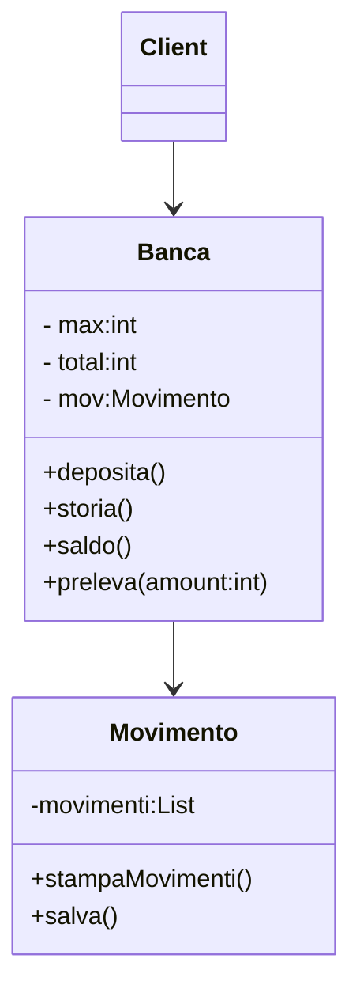

```mermaid
classDiagram

class Banca {
    - max:int
    - total:int
    - mov:Movimento
    +deposita()
    +storia()
    +saldo()
    +preleva(amount:int)
}

class Movimento {
    -movimenti:List

    +stampaMovimenti()
    +salva()
}

Client --> Banca
Banca --> Movimento
```