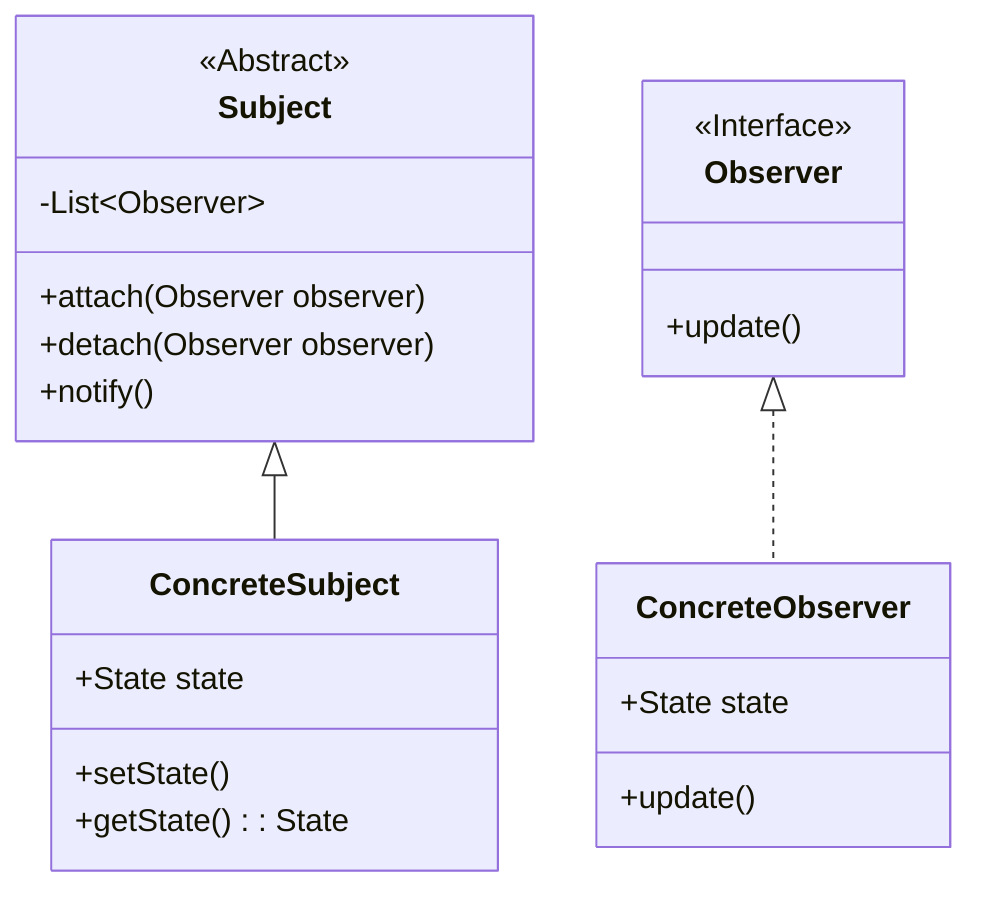
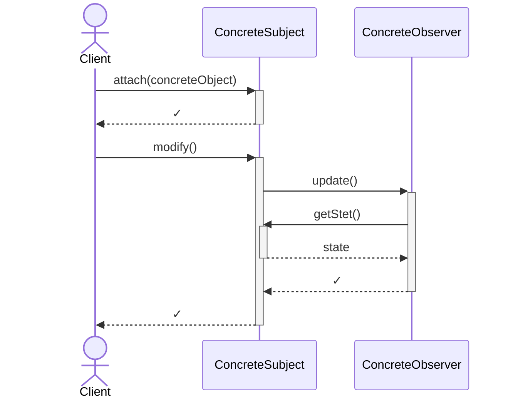
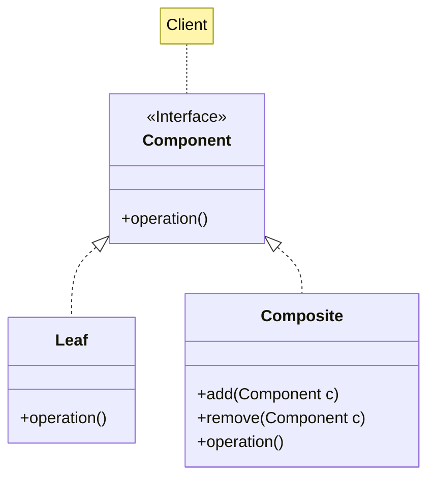
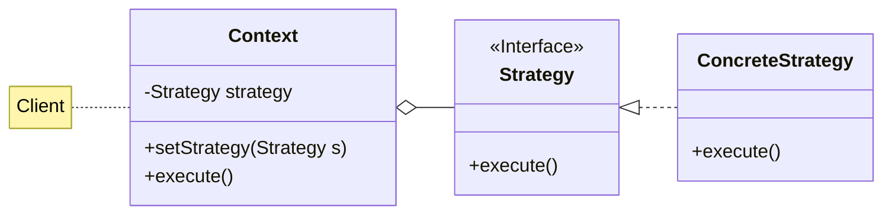
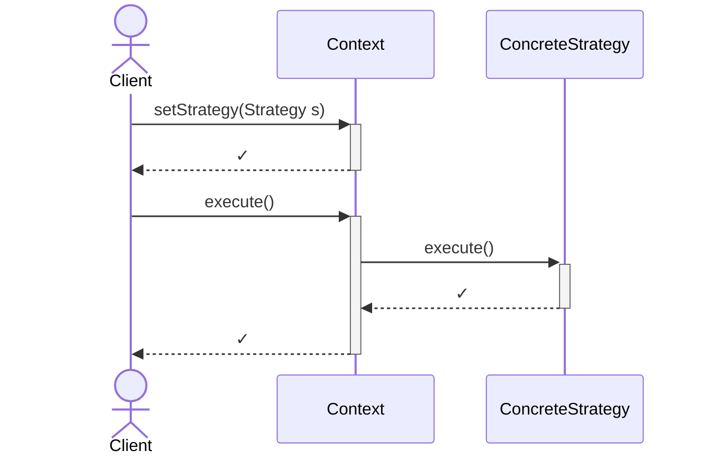

# Observer, Composite, Strategy

Descrizione dei design pattern Observer, Composite e Strategy.

<!-- New section -->

## Observer

L'observer è un design pattern comportamentale.

Definisce una dipendenza di tipo uno-a-molti tra oggetti in modo che quando un oggetto cambia lo stato, tutti i suoi oggetti dipendenti vengono notificati e aggiornati automaticamente.

<!-- New subsection -->

### Problema e soluzione

<div class="cols">

- Notificare le modifiche ogni volta che un oggetto cambia il proprio stato
- Le notifiche dovrebbero coinvolgere solo gli oggetti interessati
- Deve essere possibile aggiungere o rimuovere gli osservatori in qualsiasi momento

<br/>

- Integrare un meccanismo di iscrizione nel subject
- Il subject si occupa di notificare tutti gli oggetti iscritti quando cambia lo stato
- L'accoppiamento tra subject e observer deve essere lasco

</div>

<!-- New subsection -->

### UML



<!-- New subsection -->

### Diagramma di sequenza



<!-- New subsection -->

### Codice Subject

```java
public abstract class Subject {
    protected Set<Observer> observers;
    public void attach(Observer observer) { observers.put(observer); }
    public void detach(Observer observer) { observers.remove(observer); }
    protected void notify(Object state) {
        for (Observer observer : observers)
            observer.update(this, state);
    }
}
```

```java
public class BookStore extends Subject {
    List<Book> books;
    public List<Book> getBooks() { return books; }
    public void addBook(Book book) {
        books.add(book);
        notify(books);
    }
}
```

<!-- New subsection -->

### Codice Observer

```java
public interface Observer {
    public void update(Subject subject, Object state);
}
```

```java
public class Reader implements Observer {
    List<String> bookWishlist;

    @Override
    public void update(Subject subject, Object state){
        if (state instanceof List<Book> books){
            for (Book book : books) {
                if (wishlist.contains(book))
                    book.buy();
            }
        }
    }
}
```

<!-- New subsection -->

### Implementazione in Java

Data l'importanza del pattern, Java ne fornisce una implementazione nativa, con le interfacce `Observer` e `Observable`.
Tuttavia il loro utilizzo è stato deprecato a partire dalla versione 9.

L'alternativa nativa è rappresentata da `java.util.concurrent.Flow`, che fornisce un'interfaccia per la pubblicazione e sottoscrizione di eventi in maniera asincrona.

<!-- New subsection -->

### Possibili applicazioni

- Gestione di un'architettura distribuita
- Sistema di notifiche
- Attesa di input esterni

<!-- New subsection -->

### Pro e contro

<div class="cols">

- La lista di oggetti da notificare è dinamica
- Approccio push invece che pull
- Associazione lasca fra Subject e Observers

<br/>

- Non c'è garanzia nell'ordine delle notifiche
- L'interfaccia dell'Observer tende a essere generica e necessitare cast

</div>

<!-- New section -->

## Composite

Il composite è un design pattern strutturale.

Consente di rappresentare oggetti composti da altri oggetti in modo da trattarli come se fossero oggetti semplici.

<!-- New subsection -->

### Problema e soluzione

<div class="cols">

- Necessità di gestire una gerarchia di oggetti ad albero
- Evitare che il client si preoccupi di gestire interfacce diverse per oggetti semplici e composti
- Le chiamate devono essere riportate a tutti gli oggetti della struttura

<br/>

- Implementare una singola interfaccia per tutti gli oggetti della gerarchia
- Permettere una specializzazione, trasparente per il client, di oggetti semplici e composti
- I metodi possono essere richiamati ricorsivamente

</div>

<!-- New subsection -->

### UML



<!-- New subsection -->

### Codice

```java
public interface Item {
    public float getCost();
}
```

```java
public class Book implements Item {
    private float price;
    public float getCost() { return price; }
}
```

```java
public class Box implements Item {
    private List<Item> items;
    public void add(Item item) { items.add(item); }
    public void remove(Item item) { items.remove(item); }
    public float getCost() {
        float cost = 0;
        for (Item item : items)
            cost += item.getCost();
        return cost;
    }
}
```

<!-- New subsection -->

### Possibili applicazioni

- Strutture ad alberi
- Gestione di file e cartelle
- Organizzazione di oggetti in una gerarchia

<!-- New subsection -->

### Pro e contro

<div class="cols">

- Il client non deve conoscere la gerarchia
- È possibile interagire con gli oggetti utilizzando la medesima interfaccia

<br/>

- Non è applicabile se le differenze fra le categorie di oggetti iniziano a diventare troppo evidenti

</div>

<!-- New section -->

## Strategy

Il strategy è un design pattern comportamentale.

Consente di definire una famiglia di algoritmi, rendendoli intercambiabili e indipendenti dagli altri.

<!-- New subsection -->

### Problema e soluzione

<div class="cols">

- Necessità di utilizzare diversi algoritmi per lo stesso scopo
- Fare in modo che l'implementazione sia trasparente al client
- Poter cambiare l'algoritmo a runtime

<br/>

- Definire una interfaccia comune per tutti gli algoritmi
- Separare l'algoritmo dalla classe che lo utilizzerà
- Applicare dependency injection

</div>

<!-- New subsection -->

### UML e diagramma di sequenza



<br/>



<!-- New subsection -->

### Codice

```java
public class Graph {
    // ...
    SPAlgorithm algorithm;
    public void setShortestPathAlgorithm(SPAlgorithm algorithm) {
        this.algorithm = algorithm;
    }
    public List<Node> shortestPath(Node source, Node destination) {
        return algorithm.shortestPath(source, destination);
    }
}
```

```java
public class Dijkstra implements SPAlgorithm {
    public List<Node> shortestPath(Node source, Node destination) {
        // ...
    }
}

public class BellmanFord implements SPAlgorithm {
    public List<Node> shortestPath(Node source, Node destination) {
        // ...
    }
}
```

<!-- New subsection -->

### Possibili applicazioni

- Gestione di algoritmi di ordinamento
- Diverse metodologie di calcolo di un percorso
- Possibilità di selezione fra algoritmi più o meno efficienti a seconda delle circostanze

<!-- New subsection -->

### Pro e contro

<div class="cols">

- Possibilità di cambiare l'algoritmo a runtime
- Separazione di responsabilità fra classe e algoritmo

<br/>

- I client potrebbero avere la necessità di conoscere gli algoritmi
- Potrebbe essere sostituito da un approccio funzionale

</div>

<!-- New section -->

## Challenge

- (Observer) Implementare un sistema di notifiche per un sistema di messaggistica istantanea
- (Composite) Simulare un file system con la possibilità di ottenere informazioni come la memoria occupata
- (Strategy) Implementare un sistema di ordinamento di array di interi con diverse strategie (Bubble Sort, Merge Sort, Quick Sort, etc.)

